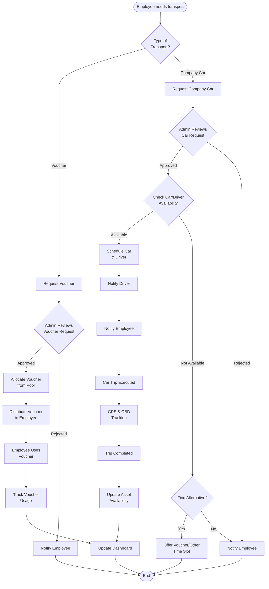
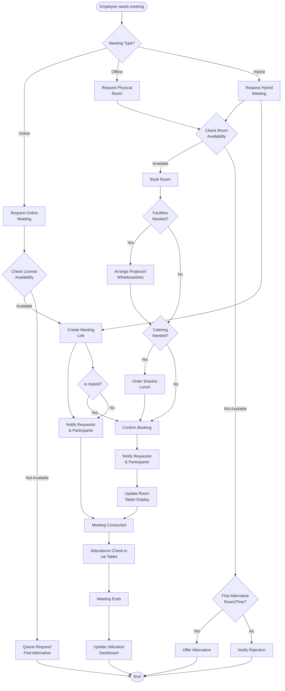
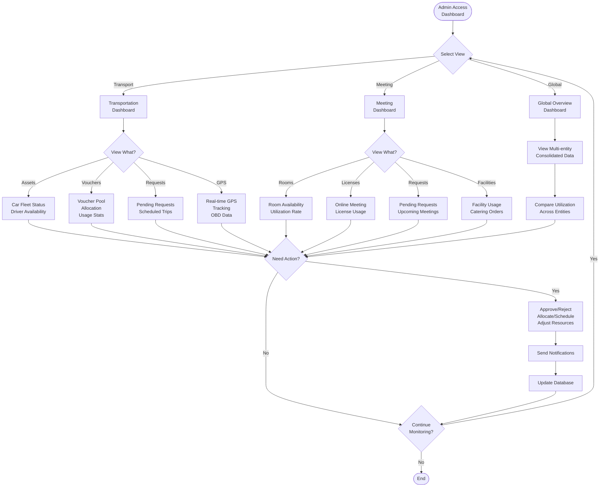
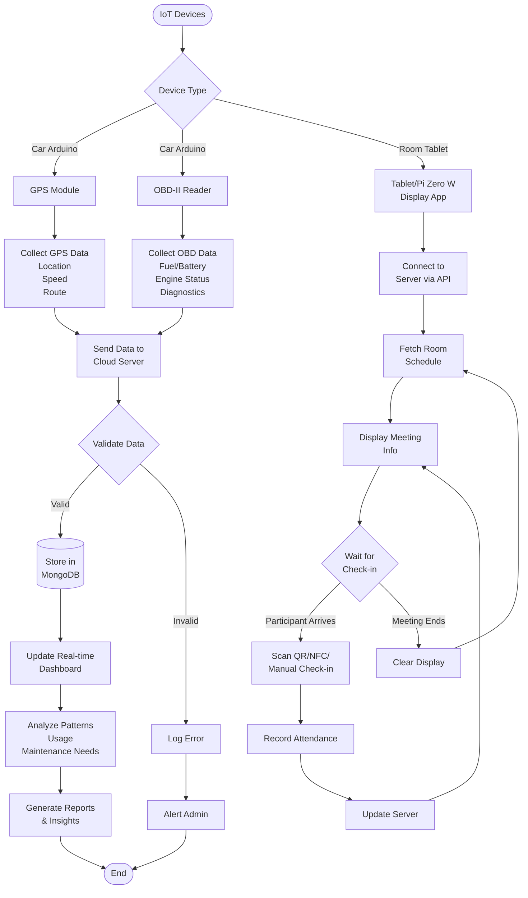

# Technology

- Svelte 5
- Typesafe typescript
- mongodb Atlas
- bun runtime
- keycloak/sso (to be implement later)
- Leaflet.js + OpenStreetMap (for mapping)

# Development Status

## Completed Features
- ✅ Dashboard with statistics and quick actions
- ✅ Navigation layout with dropdown menus
- ✅ Transportation overview page
- ✅ Meeting room overview page
- ✅ Transportation request form with geolocation and map picker
- ✅ Meeting room booking form with participant count
- ✅ Room display screen for tablets/Raspberry Pi
- ✅ Calendar views for meeting rooms and vehicles/drivers
- ✅ Round trip support for voucher allocation
- ✅ OpenStreetMap integration for company car bookings
- ✅ Calendar invitation (.ics) notification

## Pending Development
- [ ] Backend API implementation (SvelteKit API routes)
- [ ] MongoDB CRUD operations for all collections
- [ ] Authentication & authorization (JWT + role-based access)
- [ ] Admin approval workflow for requests
- [ ] Real-time GPS tracking integration (Arduino + GPS module)
- [ ] OBD-II data collection and monitoring
- [ ] Actual .ics calendar file generation and email sending
- [ ] Voucher allocation management for admins
- [ ] Driver/vehicle scheduling algorithm
- [ ] Meeting room availability conflict detection
- [ ] Online meeting platform integration (Zoom/Google Meet/Teams)
- [ ] License usage tracking and limits
- [ ] Catering order management workflow
- [ ] Notification system (email, push, in-app)
- [ ] QR/NFC check-in system for room tablets
- [ ] WebSocket for real-time updates
- [ ] Reporting and analytics dashboard
- [ ] Multi-entity/company support implementation
- [ ] Regional admin scoping
- [ ] Recurring meeting scheduler
- [ ] Cancellation and modification workflows
- [ ] Excel export functionality
- [ ] Mobile responsive optimization
- [ ] Unit and integration testing
- [ ] Documentation (API docs, user guide)

# Objective

- **Manage Employee Transportation Support**:
    - Admin need to allocate voucher(from Transportation Company/Go-Car) from employee request.
    - Admin need to schedule driver and car to transport employee based on empleyee booking.
    - having dashboard of assets(car/driver) and voucher utilization to support employee productivity
    - we will install arduino with GPS and OBD reader on each car(but what about BYD ev, is it will be different?)
- **Meeting Booking**:
    - admin need to manage booking to create (link for on-line meeting), or prepare physical room, facility, snack/lunch (for off-line meeting)
    - global admin need to see utilization of license, or facility of organisation meeting.
    - admin is regionally scooped (may have many location to manage)
    - tablet/raspberry pi zero w will be placed on in front of each rooms for displaying meeting title, and meeting attendance confirmation
- can be implemented for multi-entities company(Holding and its subsidiaries)

# Business Process

## 1. Employee Transportation Support Process

## 2. Meeting Room Booking Process

## 3. Admin Dashboard & Monitoring Process

## 4. IoT Integration Process

# Additional Information Needed

## 1. Stakeholders & Roles
- key stakeholders: GA
- Define user roles and permissions:
  - Global Admin (multi-entity access)
  - Regional Admin (location-specific)
  - Department Admin
  - Employee (requestor)
  - Driver
  - Super Admin
- Approval workflow hierarchy

## 2. Business Rules & Policies
- **Transportation:**
  - Voucher allocation criteria (position level, frequency limits, amount limits)
  - Car booking priority rules (executive vs general employee)
  - Advance booking requirements (how many days/hours in advance?)
  - Cancellation policies: Just enable/update the Car status as available
  - Emergency/urgent request handling
  - Overtime/after-hours usage policies: need Advance booking
- **Meeting Rooms:**
  - Maximum booking duration (8 Hours)
  - Advance booking window (min/max days ahead)
  - Recurring meeting policies (Need Approvals from Super Admin)
  - Cancellation/modification deadlines (need re-approval from admin)
  - No-show penalties/None
  - Room capacity vs participant count rules (each room may have different capacity)
  - Catering order lead time

## 3. Integration Requirements
- **Authentication & Authorization:**
  - SSO/LDAP/Active Directory integration? 
  - Existing HR system integration for employee data?
- **External Services:**
  - Which ride-hailing providers? (Gojek, Grab, Uber?)
  - API documentation and credentials
  - Video conferencing platforms (Zoom, Google Meet, MS Teams?)
  - License management APIs
- **Notification Channels:**
  - Email provider (SMTP settings)
  - Push notifications?
  - In-app notifications?
  - Telegram/WhatsApp integration

## 4. Data & Reporting Requirements
- **KPIs to Track:**
  - Voucher utilization rate
  - Car/driver utilization rate
  - Average trip duration/distance
  - Meeting room occupancy rate
  - License usage efficiency
  - Cost per employee transportation
  - Popular routes/times
  - No-show rates
- **Reports Needed:**
  - Daily/weekly/monthly utilization reports
  - Cost analysis reports
  - Maintenance schedule (based on OBD data)
  - Carbon footprint/sustainability metrics
  - Department-wise allocation reports
- **Data Retention:**
  - How long to keep historical data?
  - Archive policies

## 5. Hardware & Infrastructure
- **Transportation IoT:**
  - Arduino model and specifications
  - GPS module specifications
  - OBD-II reader compatibility (standard vs EV vehicles like BYD)
  - Note: EVs may need different protocols (CANbus vs OBD-II)
  - SIM cards for data transmission?
  - Power supply method
  - Installation vendor
- **Room Display:**
  - Tablet specifications or Raspberry Pi Zero W?
  - Mounting solutions
  - Power over Ethernet (PoE) or battery?
  - Display size requirements
  - Touch screen functionality needed?
  - QR code/NFC reader integration?

## 6. Security & Compliance
- Data privacy regulations (GDPR, local laws)
- Employee location tracking consent
- Data encryption (at rest and in transit)
- Audit trail requirements
- Backup and disaster recovery plan
- Access control and authentication methods

## 7. Scalability & Performance
- Expected number of users (per entity/total)
- Expected number of entities (companies)
- Expected number of cars/drivers
- Expected number of meeting rooms
- Concurrent booking capacity
- Real-time tracking data volume (GPS frequency)
- Peak usage times

## 8. Budget & Timeline
- Development timeline and milestones
- Budget for:
  - Development
  - Hardware (Arduino, tablets, accessories)
  - Cloud infrastructure (MongoDB Atlas tier)
  - External service subscriptions (ride-hailing APIs, video conferencing)
  - Maintenance and support
- ROI expectations

## 9. Pilot & Rollout Plan
- Pilot scope (which entity/location first?)
- Pilot duration
- Success criteria for pilot
- Phased rollout approach
- Training plan for admins and users
- Change management strategy

## 10. Support & Maintenance
- Support hours (24/7 or business hours?)
- SLA requirements
- Maintenance windows
- Incident escalation process
- Help desk integration
- User documentation requirements