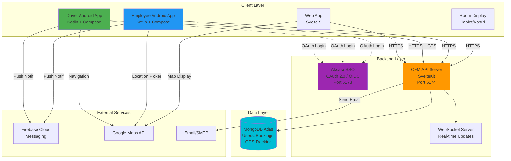

# Office Facility Management (OFM) - Development Guide
**Unified system for managing employee transportation, meeting rooms, and office facilities.**  

## Core Functions
1. Transportation Management
- Voucher allocation (Gojek, Grab, etc.)
- Company car scheduling with driver assignment
- GPS tracking via Android Driver App
- Asset and voucher utilization dashboard

2. Meeting Room Booking
- Online/offline/hybrid meeting support
- Room reservation with facility preparation
- Tablet display for room schedules
- License and facility utilization tracking

3. Multi-Entity Support
- Holding company + subsidiaries
- Regional admin scoping
- Centralized reporting

# Business Rules 
## User Roles
- **Super Admin** - Full system access
- **Global Admin** - Multi-entity access
- **Regional Admin** - Location-specific
- **Employee** - Request and view own bookings
- **Driver** - View assignments, confirm trips

## Transportation Policies
- **Cancellation**: Enable/update car status as available
- **After-hours**: Requires advance booking
- **Voucher Providers**: Gojek, Grab (managed via admin)

## Meeting Room Policies
- **Max Duration**: 8 hours
- **Recurring Meetings**: Require Super Admin approval
- **Cancellation**: Requires re-approval from admin
- **Room Capacity**: Validated against participant count

## Integration
- **Authentication**: ✅ Aksara SSO (OAuth 2.0 / OIDC)
- **Employee Sync**: ✅ SCIM 2.0 from Aksara SSO
- **Room Display**: Tablet/Raspberry Pi (QR code access)

# Development 
## Technology Stack
**Backend:**
- Svelte 5 + SvelteKit (Web UI + API Server)
- TypeScript (strict mode)
- MongoDB Atlas (Database)
- Bun Runtime
- OAuth 2.0 / OIDC (Aksara SSO integration)

**Frontend:**
- Svelte 5 (Web UI)
- Leaflet.js + OpenStreetMap (Maps)

**IoT:**
- ~~Arduino + GPS module~~ → **Android App with GPS** (Driver App)

**📱 Mobile Apps (Planned):**
- **Driver App**: Kotlin + Jetpack Compose + Retrofit + Google Maps SDK
- **Employee App**: Kotlin + Jetpack Compose + Retrofit
- **Backend**: Shared API (`/api/v1/*`) + Aksara SSO (OAuth 2.0)

****Why Android instead of Arduino GPS?****
1. ✅ Lower cost (phones vs Arduino + GPS + SIM)
2. ✅ Better UX (driver interactions, confirmations)
3. ✅ Simpler deployment (no hardware installation)
4. ✅ Real-time communication (push notifications)
5. ✅ Dual purpose (navigation + tracking)

## Documentation
See:
- `DOCS/backlog/` - project backlog
- `DOCS/modules/` - modules collection
- `DOCS/reference/` - organization structure
- `DOCS/technical/` - Development Guidelines

## Testing

---

# Development Status
## New User Requirements (High Priority)
- 📱 **Android App for Employees**: Alternative to web app for transportation requests
- 📱 **Android App for Drivers**: GPS tracking, trip management, ATA/ATD confirmation
- 📦 **Facility Request Module**: Employee requests for office facilities (ATK, equipment)

## Completed Features
- ✅ Dashboard with statistics and quick actions
- ✅ Navigation layout with dropdown menus
- ✅ Transportation overview page
- ✅ Meeting room overview page
- ✅ Transportation request form with geolocation and map picker
- ✅ Trip purpose dropdown with master data (for reporting/analytics)
- ✅ Driver wait/drop condition in request form
- ✅ Meeting room booking form with participant count
- ✅ Room display screen for tablets/Raspberry Pi
- ✅ Calendar views for meeting rooms and vehicles/drivers
- ✅ Round trip support for voucher allocation
- ✅ OpenStreetMap integration for company car bookings
- ✅ Calendar invitation (.ics) notification
- ✅ Admin dashboard with master data management
- ✅ Transport companies management (Gojek, Grab, etc.) with active/inactive toggle
- ✅ Voucher management with CSV import/export for billing reconciliation
- ✅ Trip purposes master data with category and approval flags
- ✅ Backend API implementation (SvelteKit API routes with `/api/v1/*` structure)
- ✅ Standardized API response format with pagination
- ✅ MongoDB CRUD operations for master data collections
- ✅ Reusable DataTable and Modal components
- ✅ Master data pages (vehicles, drivers, rooms, users, locations, transport companies, vouchers, trip purposes)
- ✅ Room display system with real-time schedule updates
- ✅ QR code generation for room tablet access
- ✅ OAuth 2.0 / OIDC integration with Aksara SSO
- ✅ Restricted page middleware with route protection
- ✅ Session management with auto-refresh
- ✅ Conditional navigation based on authentication state

## Pending Development
**Core System :**
- [✅] Authentication & authorization (OAuth 2.0 + OIDC with Aksara SSO)
- [✅] Restricted page/middleware and session management
- [✅] Public page & Landing Page (login page)
- [✅] SCIM employee sync from SSO (see DOCS/SCIM_INTEGRATION.md)

**Core Feature :**
- [✅] Transport companies master data (Gojek, Grab with active/inactive)
- [✅] Voucher import/export for billing reconciliation
- [✅] Trip purpose master data for reporting analytics
- [✅] Driver wait/drop condition in request form
- [ ] Build vehicle management page with driver assignments
- [ ] Build driver availability calendar page
- [ ] Build transportation approval UI with smart assignment
- [ ] Create external venue master data page
- [ ] Build event request form with accommodation
- [ ] Build event approval UI with cost tracking
- [ ] Build utilization reports by department
- [ ] Multi-entity/company support implementation
- [ ] Regional admin scoping
- [ ] Admin approval workflow for requests
- [ ] Catering order management workflow
- [ ] Cancellation and modification workflows
- [ ] Voucher allocation management for admins
- [ ] Driver/vehicle scheduling algorithm
- [ ] Driver confirm ATA and ATD
- [ ] Route used by driver
- [ ] Meeting room availability conflict detection
- [ ] number of participant (for unknown email address)
- [ ] Actual .ics calendar file generation and email sending
- [ ] Notification system (email, push, in-app)
- [ ] Reporting and analytics dashboard

**Supporting Feature :**
- [ ] Real-time GPS tracking integration (Arduino + GPS module)
- [ ] OBD-II data collection and monitoring
- [ ] QR/NFC check-in system for room tablets

**Extended Feature :**
- [ ] Mobile responsive optimization
- [ ] Online meeting platform integration (Zoom/Google Meet/Teams)
- [ ] WebSocket for real-time updates
- [ ] Excel export functionality
- [ ] Recurring meeting scheduler
- [ ] Unit and integration testing
- [✅] Documentation (API, SCIM, SSO - see DOCS/)
- [ ] User guide documentation
- [ ] License usage tracking and limits

---

# 🏗️ System Architecture Overview

---
