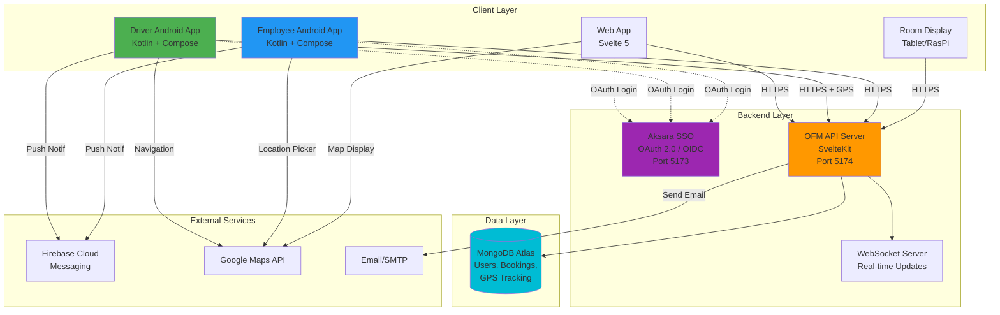

# Technology Stack

**Backend:**
- Svelte 5 + SvelteKit (Web UI + API Server)
- TypeScript (strict mode)
- MongoDB Atlas (Database)
- Bun Runtime
- OAuth 2.0 / OIDC (Aksara SSO integration)

**Frontend:**
- Svelte 5 (Web UI)
- Leaflet.js + OpenStreetMap (Maps)

**Mobile (NEW):**
- Android (Kotlin + Jetpack Compose)
- Retrofit (API client)
- Google Maps SDK
- FCM (Push notifications)

**IoT:**
- ~~Arduino + GPS module~~ → **Android App with GPS** (Driver App)

---

# 🚀 Latest Updates (2025-10-17)

✅ **Transport Companies & Voucher Management**: Complete CRUD for Gojek/Grab providers with voucher import/export
✅ **Trip Purpose Master Data**: Categorized purposes for reporting with dropdown in request form
✅ **Driver Wait/Drop Condition**: Added checkbox for driver to wait or just drop-off
✅ **API Standardization**: Implemented `/api/v1/*` structure with pagination support
✅ **Authentication Fixed**: OAuth 2.0 integration with Aksara SSO completed
✅ **Route Protection**: Middleware now restricts unauthenticated access
✅ **Session Management**: Auto-refresh tokens before expiry
🆕 **New Requirements**: Android apps for employees and drivers
🆕 **Facility Management**: Office supplies (ATK) request module
📱 **Architecture Shift**: Arduino GPS → Android Driver App

**Next Priority**: Build transportation approval workflow and driver assignment system

---

# Development Status
## New User Requirements (High Priority)
- 📱 **Android App for Employees**: Alternative to web app for transportation requests
- 📱 **Android App for Drivers**: GPS tracking, trip management, ATA/ATD confirmation
- 📦 **Facility Request Module**: Employee requests for office facilities (ATK, equipment)

## Completed Features
- ✅ Dashboard with statistics and quick actions
- ✅ Navigation layout with dropdown menus
- ✅ Transportation overview page
- ✅ Meeting room overview page
- ✅ Transportation request form with geolocation and map picker
- ✅ Trip purpose dropdown with master data (for reporting/analytics)
- ✅ Driver wait/drop condition in request form
- ✅ Meeting room booking form with participant count
- ✅ Room display screen for tablets/Raspberry Pi
- ✅ Calendar views for meeting rooms and vehicles/drivers
- ✅ Round trip support for voucher allocation
- ✅ OpenStreetMap integration for company car bookings
- ✅ Calendar invitation (.ics) notification
- ✅ Admin dashboard with master data management
- ✅ Transport companies management (Gojek, Grab, etc.) with active/inactive toggle
- ✅ Voucher management with CSV import/export for billing reconciliation
- ✅ Trip purposes master data with category and approval flags
- ✅ Backend API implementation (SvelteKit API routes with `/api/v1/*` structure)
- ✅ Standardized API response format with pagination
- ✅ MongoDB CRUD operations for master data collections
- ✅ Reusable DataTable and Modal components
- ✅ Master data pages (vehicles, drivers, rooms, users, locations, transport companies, vouchers, trip purposes)
- ✅ Room display system with real-time schedule updates
- ✅ QR code generation for room tablet access
- ✅ OAuth 2.0 / OIDC integration with Aksara SSO
- ✅ Restricted page middleware with route protection
- ✅ Session management with auto-refresh
- ✅ Conditional navigation based on authentication state

## Pending Development
**Core System :**
- [✅] Authentication & authorization (OAuth 2.0 + OIDC with Aksara SSO)
- [✅] Restricted page/middleware and session management
- [✅] Public page & Landing Page (login page)
- [ ] Implement SCIM employee sync from SSO

**Core Feature :**
- [✅] Transport companies master data (Gojek, Grab with active/inactive)
- [✅] Voucher import/export for billing reconciliation
- [✅] Trip purpose master data for reporting analytics
- [✅] Driver wait/drop condition in request form
- [ ] Build vehicle management page with driver assignments
- [ ] Build driver availability calendar page
- [ ] Build transportation approval UI with smart assignment
- [ ] Create external venue master data page
- [ ] Build event request form with accommodation
- [ ] Build event approval UI with cost tracking
- [ ] Build utilization reports by department
- [ ] Multi-entity/company support implementation
- [ ] Regional admin scoping
- [ ] Admin approval workflow for requests
- [ ] Catering order management workflow
- [ ] Cancellation and modification workflows
- [ ] Voucher allocation management for admins
- [ ] Driver/vehicle scheduling algorithm
- [ ] Driver confirm ATA and ATD
- [ ] Route used by driver
- [ ] Meeting room availability conflict detection
- [ ] number of participant (for unknown email address)
- [ ] Actual .ics calendar file generation and email sending
- [ ] Notification system (email, push, in-app)
- [ ] Reporting and analytics dashboard

**Supporting Feature :**
- [ ] Real-time GPS tracking integration (Arduino + GPS module)
- [ ] OBD-II data collection and monitoring
- [ ] QR/NFC check-in system for room tablets

**Extended Feature :**
- [ ] Mobile responsive optimization
- [ ] Online meeting platform integration (Zoom/Google Meet/Teams)
- [ ] WebSocket for real-time updates
- [ ] Excel export functionality
- [ ] Recurring meeting scheduler
- [ ] Unit and integration testing
- [ ] Documentation (API docs, user guide)
- [ ] License usage tracking and limits

---

# 🏗️ System Architecture Overview



---

# 🎯 Re-Prioritized Development Roadmap

Based on new requirements for Android apps and facility management, here's the recommended development sequence:

## Phase 1: API Foundation (Week 1-2) ⭐⭐⭐ CRITICAL
**Goal**: Build RESTful API to support both web and mobile clients

1. **RESTful API Design & Implementation**
   - [ ] Design API structure (`/api/v1/*`)
   - [ ] Implement authentication middleware (JWT from SSO)
   - [ ] Create standardized response format (success/error handling)
   - [ ] Add API rate limiting and security headers

2. **Transportation API Endpoints**
   - [ ] `POST /api/v1/requests/transport` - Create transport request
   - [ ] `GET /api/v1/requests/transport` - List requests (with filters)
   - [ ] `GET /api/v1/requests/transport/:id` - Get request details
   - [ ] `PATCH /api/v1/requests/transport/:id` - Update request status
   - [ ] `DELETE /api/v1/requests/transport/:id` - Cancel request

3. **Driver API Endpoints** (for Android Driver App)
   - [ ] `GET /api/v1/driver/assignments` - Get assigned trips
   - [ ] `POST /api/v1/driver/location` - Update GPS location
   - [ ] `POST /api/v1/driver/trip/:id/start` - Confirm trip start (ATA)
   - [ ] `POST /api/v1/driver/trip/:id/complete` - Confirm trip end (ATD)
   - [ ] `POST /api/v1/driver/trip/:id/route` - Submit route data

4. **Facility Request API Endpoints** (NEW)
   - [ ] `POST /api/v1/requests/facility` - Create facility request (ATK, equipment)
   - [ ] `GET /api/v1/requests/facility` - List facility requests
   - [ ] `PATCH /api/v1/requests/facility/:id` - Update status (approve/reject)

5. **API Documentation**
   - [ ] OpenAPI/Swagger specification
   - [ ] API testing collection (Postman/Insomnia)

## Phase 2: Mobile Infrastructure (Week 3-4) ⭐⭐⭐ HIGH PRIORITY
**Goal**: Enable mobile app authentication and data sync

1. **Mobile Authentication Flow**
   - [ ] Implement OAuth 2.0 for mobile apps
   - [ ] Mobile token refresh mechanism
   - [ ] Device registration/management

2. **Real-time Communication**
   - [ ] WebSocket server setup for live updates
   - [ ] Push notification infrastructure (FCM for Android)
   - [ ] Event subscription system (trip updates, approvals)

3. **GPS & Location Services**
   - [ ] Real-time GPS tracking endpoint
   - [ ] Location history storage and retrieval
   - [ ] Geofencing for pickup/dropoff zones

## Phase 3: Android Driver App (Week 5-6) ⭐⭐⭐ HIGH PRIORITY
**Goal**: Replace Arduino GPS with Android app for drivers

**Technology Stack**:
- Kotlin + Jetpack Compose
- Retrofit for API calls
- Google Maps SDK
- Background location service

**Core Features**:
1. **Authentication**
   - [ ] SSO login via OAuth 2.0
   - [ ] Biometric authentication (fingerprint)

2. **Trip Management**
   - [ ] View assigned trips (today's schedule)
   - [ ] Trip details (pickup, destination, passenger info)
   - [ ] Navigation integration (Google Maps)
   - [ ] Confirm ATA (Actual Time of Arrival)
   - [ ] Confirm ATD (Actual Time of Departure)

3. **GPS Tracking**
   - [ ] Background GPS service (continuous tracking during trips)
   - [ ] Send location updates every 30 seconds
   - [ ] Route recording and submission
   - [ ] Offline mode with sync when online

4. **Status Management**
   - [ ] Driver availability toggle (on duty/off duty)
   - [ ] Trip status updates (started, in-progress, completed)
   - [ ] Emergency/SOS button

## Phase 4: Android Employee App (Week 7-8) ⭐⭐ MEDIUM PRIORITY
**Goal**: Provide mobile alternative for employees to make requests

**Technology Stack**:
- Kotlin + Jetpack Compose
- Retrofit for API calls
- Google Maps SDK for location picker

**Core Features**:
1. **Authentication**
   - [ ] SSO login via OAuth 2.0

2. **Transportation Requests**
   - [ ] Request company car (with map picker)
   - [ ] Request voucher
   - [ ] View request history
   - [ ] Cancel/modify requests

3. **Meeting Room Booking**
   - [ ] Browse available rooms
   - [ ] Book room with details
   - [ ] View booking calendar

4. **Facility Requests** (NEW)
   - [ ] Request office supplies (ATK)
   - [ ] Request equipment/facilities
   - [ ] Track request status

5. **Notifications**
   - [ ] Push notifications for approvals/rejections
   - [ ] Trip reminders
   - [ ] Meeting reminders

## Phase 5: Admin Workflow (Week 9-10) ⭐⭐ MEDIUM PRIORITY
**Goal**: Enable admins to approve/manage requests

1. **Admin Approval Workflow**
   - [ ] Pending requests dashboard
   - [ ] One-click approve/reject
   - [ ] Bulk actions
   - [ ] Approval delegation

2. **Driver/Vehicle Scheduling Algorithm**
   - [ ] Auto-assign available drivers
   - [ ] Optimize routes
   - [ ] Handle conflicts

3. **Facility Management** (NEW)
   - [ ] Inventory tracking (ATK stock levels)
   - [ ] Approval workflow for facility requests
   - [ ] Purchase order generation

## Phase 6: Advanced Features (Week 11+) ⭐ LOWER PRIORITY
1. **Multi-entity support**
2. **Advanced reporting & analytics**
3. **WhatsApp/Telegram notifications**
4. **Excel import/export**
5. **OBD-II integration (for cars without drivers)**

---

# 🎬 Quick Start for Next Phase

## Immediate Next Steps (Phase 1: API Foundation)

1. **Create API Route Structure**
   ```bash
   mkdir -p src/routes/api/v1/{requests,driver,auth}
   ```

2. **Design API Response Format**
   ```typescript
   // src/lib/server/api/response.ts
   interface ApiResponse<T> {
     success: boolean;
     data?: T;
     error?: {
       code: string;
       message: string;
     };
     meta?: {
       page?: number;
       limit?: number;
       total?: number;
     };
   }
   ```

3. **Create Authentication Middleware**
   ```typescript
   // src/lib/server/api/auth.ts
   export async function requireAuth(event: RequestEvent) {
     const token = event.request.headers.get('Authorization')?.replace('Bearer ', '');
     if (!token) throw error(401, 'Unauthorized');
     // Validate JWT token from SSO
   }
   ```

4. **Start with Transportation Request Endpoint**
   ```typescript
   // src/routes/api/v1/requests/transport/+server.ts
   export async function POST({ request, locals }) {
     // Create transport request
   }

   export async function GET({ url, locals }) {
     // List transport requests with filters
   }
   ```

5. **Update Database Schemas**
   - Add `facilityRequests` collection schema
   - Add `driverLocations` collection for GPS tracking
   - Add `tripEvents` collection for ATA/ATD logs

---

# 📱 Android App Architecture

## Shared Backend (OFM Web App)
- SvelteKit API endpoints (`/api/v1/*`)
- MongoDB database (shared with web)
- Aksara SSO for authentication

## Driver App (Kotlin + Jetpack Compose)
```
com.ofm.driver/
├── data/
│   ├── api/          # Retrofit API clients
│   ├── repository/   # Data repositories
│   └── model/        # Data models
├── ui/
│   ├── login/        # Login screen
│   ├── trips/        # Trip list & details
│   ├── tracking/     # Live tracking screen
│   └── profile/      # Driver profile
├── service/
│   └── LocationService.kt  # Background GPS tracking
└── util/
    ├── AuthManager.kt      # OAuth 2.0 handling
    └── NotificationManager.kt
```

## Employee App (Kotlin + Jetpack Compose)
```
com.ofm.employee/
├── data/
│   ├── api/          # Retrofit API clients
│   ├── repository/   # Data repositories
│   └── model/        # Data models
├── ui/
│   ├── login/        # Login screen
│   ├── home/         # Dashboard
│   ├── transport/    # Transport request screens
│   ├── meeting/      # Meeting booking screens
│   └── facility/     # Facility request screens (NEW)
└── util/
    ├── AuthManager.kt
    └── NotificationManager.kt
```

## Key Technical Decisions

### Why Android instead of Arduino?
1. ✅ **Lower Hardware Cost**: Android phones vs Arduino + GPS + SIM card
2. ✅ **Better UX**: Drivers can interact with app (confirmations, status updates)
3. ✅ **Simpler Deployment**: No hardware installation required
4. ✅ **Real-time Communication**: Push notifications, chat with admin
5. ✅ **Dual Purpose**: Navigation + tracking in one device

### API-First Design
- Web app and mobile apps share the same backend API
- Easy to add more clients (iOS, desktop) in the future
- Clear separation of concerns

### Authentication Strategy
- All apps use Aksara SSO via OAuth 2.0
- JWT tokens for API authentication
- Refresh token mechanism for mobile apps

---

# Objective

- **Manage Employee Transportation Support**:
    - Admin need to allocate voucher(from Transportation Company/Go-Car) from employee request.
    - Admin need to schedule driver and car to transport employee based on empleyee booking.
    - having dashboard of assets(car/driver) and voucher utilization to support employee productivity
    - we will install arduino with GPS and OBD reader on each car(but what about BYD ev, is it will be different?)
- **Meeting Booking**:
    - admin need to manage booking to create (link for on-line meeting), or prepare physical room, facility, snack/lunch (for off-line meeting)
    - global admin need to see utilization of license, or facility of organisation meeting.
    - admin is regionally scooped (may have many location to manage)
    - tablet/raspberry pi zero w will be placed on in front of each rooms for displaying meeting title, and meeting attendance confirmation
- can be implemented for multi-entities company(Holding and its subsidiaries)

---

# Related Files
Documentation is in: DOCS/*.md

- ./DOCS/example_org_structure.md - example of organizations structure we need to implement.
- ./DOCS/DATABASE.md - Database Setup Guide
- ./DOCS/FEATURES.md - OFM Features Documentation
- ./DOCS/BUSINESS_PROCESS.md - Business Process


## Important Reminders

- **Update CLAUDE.md _Development Status_ as you complete tasks** (mark with `[✅]`)
- **Make reusable code** dont make more than ~500 lines of codes in one file, implements utils/library
- dont mix Svelte 4 (on:click) and Svelte 5 (onclick) syntax

---

# Additional Information Needed

## 1. Stakeholders & Roles
- key stakeholders: GA
- Define user roles and permissions:
  - Global Admin (multi-entity access)
  - Regional Admin (location-specific)
  - Department Admin
  - Employee (requestor)
  - Driver
  - Super Admin
- Approval workflow hierarchy

## 2. Business Rules & Policies
- **Transportation:**
  - Voucher allocation criteria (position level, frequency limits, amount limits)
  - Car booking priority rules (executive vs general employee)
  - Advance booking requirements (how many days/hours in advance?)
  - Cancellation policies: Just enable/update the Car status as available
  - Emergency/urgent request handling
  - Overtime/after-hours usage policies: need Advance booking
- **Meeting Rooms:**
  - Maximum booking duration (8 Hours)
  - Advance booking window (min/max days ahead)
  - Recurring meeting policies (Need Approvals from Super Admin)
  - Cancellation/modification deadlines (need re-approval from admin)
  - No-show penalties/None
  - Room capacity vs participant count rules (each room may have different capacity)
  - Catering order lead time

## 3. Integration Requirements
- **Authentication & Authorization:**
  - SSO/LDAP/Active Directory integration? 
  - Existing HR system integration for employee data?
- **External Services:**
  - Which ride-hailing providers? (Gojek, Grab, Uber?)
  - API documentation and credentials
  - Video conferencing platforms (Zoom, Google Meet, MS Teams?)
  - License management APIs
- **Notification Channels:**
  - Email provider (SMTP settings)
  - Push notifications?
  - In-app notifications?
  - Telegram/WhatsApp integration

## 4. Data & Reporting Requirements
- **KPIs to Track:**
  - Voucher utilization rate
  - Car/driver utilization rate
  - Average trip duration/distance
  - Meeting room occupancy rate
  - License usage efficiency
  - Cost per employee transportation
  - Popular routes/times
  - No-show rates
- **Reports Needed:**
  - Daily/weekly/monthly utilization reports
  - Cost analysis reports
  - Maintenance schedule (based on OBD data)
  - Carbon footprint/sustainability metrics
  - Department-wise allocation reports
- **Data Retention:**
  - How long to keep historical data?
  - Archive policies

## 5. Hardware & Infrastructure
- **Transportation IoT:**
  - Arduino model and specifications
  - GPS module specifications
  - OBD-II reader compatibility (standard vs EV vehicles like BYD)
  - Note: EVs may need different protocols (CANbus vs OBD-II)
  - data transmission: SIM cards with internet 3G network
  - Power supply: Car Battery
  - Installation vendor
- **Room Display:**
  - Tablet specifications or Raspberry Pi Zero W?
  - Mounting solutions
  - Power over Ethernet (PoE) or battery?
  - Display size requirements
  - Touch screen functionality needed?
  - QR code/NFC reader integration?

## 6. Security & Compliance
- Data privacy regulations (GDPR, local laws)
- Employee location tracking consent
- Data encryption (at rest and in transit)
- Audit trail requirements
- Backup and disaster recovery plan
- Access control and authentication methods

## 7. Scalability & Performance
- Expected number of users (per entity/total)
- Expected number of entities (companies)
- Expected number of cars/drivers
- Expected number of meeting rooms
- Concurrent booking capacity
- Real-time tracking data volume (GPS frequency)
- Peak usage times

## 8. Budget & Timeline
- Development timeline and milestones
- Budget for:
  - Development
  - Hardware (Arduino, tablets, accessories)
  - Cloud infrastructure (MongoDB Atlas tier)
  - External service subscriptions (ride-hailing APIs, video conferencing)
  - Maintenance and support
- ROI expectations

## 9. Pilot & Rollout Plan
- Pilot scope (which entity/location first?)
- Pilot duration
- Success criteria for pilot
- Phased rollout approach
- Training plan for admins and users
- Change management strategy

## 10. Support & Maintenance
- Support hours (24/7 or business hours?)
- SLA requirements
- Maintenance windows
- Incident escalation process
- Help desk integration
- User documentation requirements