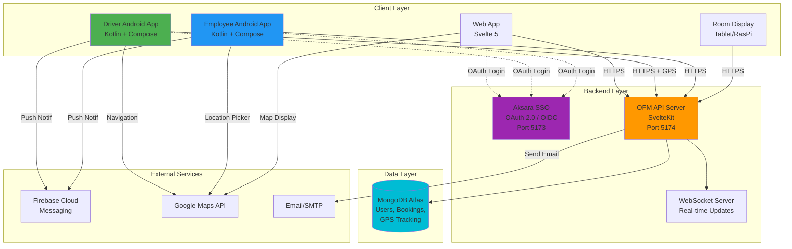

# Development 
## Technology Stack
**Backend:**
- Svelte 5 + SvelteKit (Web UI + API Server)
- TypeScript (strict mode)
- MongoDB Atlas (Database)
- Bun Runtime
- OAuth 2.0 / OIDC (Aksara SSO integration)

**Frontend:**
- Svelte 5 (Web UI)
- Leaflet.js + OpenStreetMap (Maps)

**Mobile (NEW):**
- Android (Kotlin + Jetpack Compose)
- Retrofit (API client)
- Google Maps SDK
- FCM (Push notifications)

**IoT:**
- ~~Arduino + GPS module~~ → **Android App with GPS** (Driver App)

## Documentation

## Preparation

## Testing

---

# 🚀 Latest Updates (2025-11-05)

✅ **SCIM Integration**: Employee sync from Aksara SSO with webhooks (see DOCS/SCIM_INTEGRATION.md)
✅ **Settings Management**: Database-backed configuration with web UI (see DOCS/SETTINGS_MANAGEMENT.md)
✅ **Comprehensive API**: 22+ API modules implemented (see DOCS/API.md)
✅ **Transport Companies & Voucher Management**: Complete CRUD with CSV import/export
✅ **Trip Purpose Master Data**: Categorized purposes for analytics
✅ **Authentication & Session**: OAuth 2.0 + OIDC with auto-refresh
📱 **Architecture Decision**: Android Driver App (replacing Arduino GPS)
🎯 **Documentation Complete**: API, SCIM, SSO, Data Sync, Business Process

**Next Priority**: Build approval workflow and driver assignment system

---

## Implementation Notes

### Business Process Ambiguities & Recommendations

The following design decisions need to be finalized during implementation:

#### 1. Voucher Distribution Method
- **Question:** How should voucher codes be delivered to employees?
  - Email the code to employee?
  - Display in web app?
  - Push notification?
- **Recommendation:** All of the above for redundancy
- **Status:** Pending implementation

#### 2. Driver Notification Timing
- **Question:** When should drivers be notified about assignments?
  - Immediately upon approval?
  - X hours before trip?
- **Recommendation:** Both (immediate notification + reminder 2 hours before trip)
- **Status:** Pending implementation

#### 3. Alternative Offer Workflow
- **Question:** When car is unavailable, should system auto-offer voucher or require admin decision?
- **Recommendation:** Admin decides, system suggests (better control over budget)
- **Status:** Pending implementation

#### 4. Trip Completion Criteria
- **Question:** How to mark trip as completed?
  - Driver confirms in app?
  - Auto-complete after X hours?
- **Recommendation:** Driver confirms + auto-complete after 12 hours as fallback
- **Status:** Pending implementation (driver app needed)

#### 5. Meeting Approval Rules
- **Question:** Do all meetings need approval or only certain types?
- **Recommendation:** Configurable per room (e.g., VIP rooms need approval, regular rooms auto-approved)
- **Status:** Pending implementation

---

# Development Status
## New User Requirements (High Priority)
- 📱 **Android App for Employees**: Alternative to web app for transportation requests
- 📱 **Android App for Drivers**: GPS tracking, trip management, ATA/ATD confirmation
- 📦 **Facility Request Module**: Employee requests for office facilities (ATK, equipment)

## Completed Features
- ✅ Dashboard with statistics and quick actions
- ✅ Navigation layout with dropdown menus
- ✅ Transportation overview page
- ✅ Meeting room overview page
- ✅ Transportation request form with geolocation and map picker
- ✅ Trip purpose dropdown with master data (for reporting/analytics)
- ✅ Driver wait/drop condition in request form
- ✅ Meeting room booking form with participant count
- ✅ Room display screen for tablets/Raspberry Pi
- ✅ Calendar views for meeting rooms and vehicles/drivers
- ✅ Round trip support for voucher allocation
- ✅ OpenStreetMap integration for company car bookings
- ✅ Calendar invitation (.ics) notification
- ✅ Admin dashboard with master data management
- ✅ Transport companies management (Gojek, Grab, etc.) with active/inactive toggle
- ✅ Voucher management with CSV import/export for billing reconciliation
- ✅ Trip purposes master data with category and approval flags
- ✅ Backend API implementation (SvelteKit API routes with `/api/v1/*` structure)
- ✅ Standardized API response format with pagination
- ✅ MongoDB CRUD operations for master data collections
- ✅ Reusable DataTable and Modal components
- ✅ Master data pages (vehicles, drivers, rooms, users, locations, transport companies, vouchers, trip purposes)
- ✅ Room display system with real-time schedule updates
- ✅ QR code generation for room tablet access
- ✅ OAuth 2.0 / OIDC integration with Aksara SSO
- ✅ Restricted page middleware with route protection
- ✅ Session management with auto-refresh
- ✅ Conditional navigation based on authentication state

## Pending Development
**Core System :**
- [✅] Authentication & authorization (OAuth 2.0 + OIDC with Aksara SSO)
- [✅] Restricted page/middleware and session management
- [✅] Public page & Landing Page (login page)
- [✅] SCIM employee sync from SSO (see DOCS/SCIM_INTEGRATION.md)

**Core Feature :**
- [✅] Transport companies master data (Gojek, Grab with active/inactive)
- [✅] Voucher import/export for billing reconciliation
- [✅] Trip purpose master data for reporting analytics
- [✅] Driver wait/drop condition in request form
- [ ] Build vehicle management page with driver assignments
- [ ] Build driver availability calendar page
- [ ] Build transportation approval UI with smart assignment
- [ ] Create external venue master data page
- [ ] Build event request form with accommodation
- [ ] Build event approval UI with cost tracking
- [ ] Build utilization reports by department
- [ ] Multi-entity/company support implementation
- [ ] Regional admin scoping
- [ ] Admin approval workflow for requests
- [ ] Catering order management workflow
- [ ] Cancellation and modification workflows
- [ ] Voucher allocation management for admins
- [ ] Driver/vehicle scheduling algorithm
- [ ] Driver confirm ATA and ATD
- [ ] Route used by driver
- [ ] Meeting room availability conflict detection
- [ ] number of participant (for unknown email address)
- [ ] Actual .ics calendar file generation and email sending
- [ ] Notification system (email, push, in-app)
- [ ] Reporting and analytics dashboard

**Supporting Feature :**
- [ ] Real-time GPS tracking integration (Arduino + GPS module)
- [ ] OBD-II data collection and monitoring
- [ ] QR/NFC check-in system for room tablets

**Extended Feature :**
- [ ] Mobile responsive optimization
- [ ] Online meeting platform integration (Zoom/Google Meet/Teams)
- [ ] WebSocket for real-time updates
- [ ] Excel export functionality
- [ ] Recurring meeting scheduler
- [ ] Unit and integration testing
- [✅] Documentation (API, SCIM, SSO - see DOCS/)
- [ ] User guide documentation
- [ ] License usage tracking and limits

---

# 🏗️ System Architecture Overview

---

# 🎯 Re-Prioritized Development Roadmap

Based on new requirements for Android apps and facility management, here's the recommended development sequence:

## Phase 1: API Foundation ✅ COMPLETE
**Goal**: Build RESTful API to support both web and mobile clients

**Status**: All core APIs implemented (22+ modules)
- ✅ `/api/v1/transport/*` - Transport requests
- ✅ `/api/v1/meeting/*` - Meeting bookings
- ✅ `/api/v1/driver/*` - Driver operations
- ✅ `/api/v1/facilities/*` - Facility requests
- ✅ `/api/v1/scim/*` - SCIM integration
- ✅ `/api/v1/settings/*` - System settings
- ✅ Master data APIs (vehicles, drivers, rooms, users, etc.)
- ✅ Authentication middleware (OAuth 2.0 + sessions)
- ✅ Standardized response format with pagination

**See**: `DOCS/API.md` for complete API reference

## Phase 2: Mobile Infrastructure (Week 3-4) ⭐⭐⭐ HIGH PRIORITY
**Goal**: Enable mobile app authentication and data sync

1. **Mobile Authentication Flow**
   - [ ] Implement OAuth 2.0 for mobile apps
   - [ ] Mobile token refresh mechanism
   - [ ] Device registration/management

2. **Real-time Communication**
   - [ ] WebSocket server setup for live updates
   - [ ] Push notification infrastructure (FCM for Android)
   - [ ] Event subscription system (trip updates, approvals)

3. **GPS & Location Services**
   - [ ] Real-time GPS tracking endpoint
   - [ ] Location history storage and retrieval
   - [ ] Geofencing for pickup/dropoff zones

## Phase 3: Android Driver App (Week 5-6) ⭐⭐⭐ HIGH PRIORITY
**Goal**: Replace Arduino GPS with Android app for drivers

**Technology Stack**:
- Kotlin + Jetpack Compose
- Retrofit for API calls
- Google Maps SDK
- Background location service

**Core Features**:
1. **Authentication**
   - [ ] SSO login via OAuth 2.0
   - [ ] Biometric authentication (fingerprint)

2. **Trip Management**
   - [ ] View assigned trips (today's schedule)
   - [ ] Trip details (pickup, destination, passenger info)
   - [ ] Navigation integration (Google Maps)
   - [ ] Confirm ATA (Actual Time of Arrival)
   - [ ] Confirm ATD (Actual Time of Departure)

3. **GPS Tracking**
   - [ ] Background GPS service (continuous tracking during trips)
   - [ ] Send location updates every 30 seconds
   - [ ] Route recording and submission
   - [ ] Offline mode with sync when online

4. **Status Management**
   - [ ] Driver availability toggle (on duty/off duty)
   - [ ] Trip status updates (started, in-progress, completed)
   - [ ] Emergency/SOS button

## Phase 4: Android Employee App (Week 7-8) ⭐⭐ MEDIUM PRIORITY
**Goal**: Provide mobile alternative for employees to make requests

**Technology Stack**:
- Kotlin + Jetpack Compose
- Retrofit for API calls
- Google Maps SDK for location picker

**Core Features**:
1. **Authentication**
   - [ ] SSO login via OAuth 2.0

2. **Transportation Requests**
   - [ ] Request company car (with map picker)
   - [ ] Request voucher
   - [ ] View request history
   - [ ] Cancel/modify requests

3. **Meeting Room Booking**
   - [ ] Browse available rooms
   - [ ] Book room with details
   - [ ] View booking calendar

4. **Facility Requests** (NEW)
   - [ ] Request office supplies (ATK)
   - [ ] Request equipment/facilities
   - [ ] Track request status

5. **Notifications**
   - [ ] Push notifications for approvals/rejections
   - [ ] Trip reminders
   - [ ] Meeting reminders

## Phase 5: Admin Workflow (Week 9-10) ⭐⭐ MEDIUM PRIORITY
**Goal**: Enable admins to approve/manage requests

1. **Admin Approval Workflow**
   - [ ] Pending requests dashboard
   - [ ] One-click approve/reject
   - [ ] Bulk actions
   - [ ] Approval delegation

2. **Driver/Vehicle Scheduling Algorithm**
   - [ ] Auto-assign available drivers
   - [ ] Optimize routes
   - [ ] Handle conflicts

3. **Facility Management** (NEW)
   - [ ] Inventory tracking (ATK stock levels)
   - [ ] Approval workflow for facility requests
   - [ ] Purchase order generation

## Phase 6: Advanced Features (Week 11+) ⭐ LOWER PRIORITY
1. **Multi-entity support**
2. **Advanced reporting & analytics**
3. **WhatsApp/Telegram notifications**
4. **Excel import/export**
5. **OBD-II integration (for cars without drivers)**

---

# 📱 Mobile Apps (Planned)

## Technology Stack
- **Driver App**: Kotlin + Jetpack Compose + Retrofit + Google Maps SDK
- **Employee App**: Kotlin + Jetpack Compose + Retrofit
- **Backend**: Shared API (`/api/v1/*`) + Aksara SSO (OAuth 2.0)

## Why Android instead of Arduino GPS?
1. ✅ Lower cost (phones vs Arduino + GPS + SIM)
2. ✅ Better UX (driver interactions, confirmations)
3. ✅ Simpler deployment (no hardware installation)
4. ✅ Real-time communication (push notifications)
5. ✅ Dual purpose (navigation + tracking)

---

# Project Objective

**Office Facility Management (OFM)** - Unified system for managing employee transportation, meeting rooms, and office facilities.

## Core Functions

### 1. Transportation Management
- Voucher allocation (Gojek, Grab, etc.)
- Company car scheduling with driver assignment
- GPS tracking via Android Driver App
- Asset and voucher utilization dashboard

### 2. Meeting Room Booking
- Online/offline/hybrid meeting support
- Room reservation with facility preparation
- Tablet display for room schedules
- License and facility utilization tracking

### 3. Multi-Entity Support
- Holding company + subsidiaries
- Regional admin scoping
- Centralized reporting

---

# Documentation Reference

## Technical Documentation (DOCS/)
- **API.md** - Complete API reference with 22+ endpoints
- **SCIM_INTEGRATION.md** - Employee sync setup guide
- **SETTINGS_MANAGEMENT.md** - Database-backed configuration
- **SSO_INTEGRATION.md** - OAuth 2.0 / OIDC setup
- **DATA_SYNC_STRATEGY.md** - SSO ↔ OFM data architecture
- **BUSINESS_PROCESS.md** - Business workflows with flowcharts
- **ROOM_DISPLAY.md** - Tablet display system
- **DATABASE.md** - Database setup and schema
- **FEATURES.md** - Feature overview
- **example_org_structure.md** - IAS organization structure

## Development Guidelines

### Reusables Philosophy
- **ALWAYS check `DOCS/REUSABLES.md` before writing new code**
- This app has 20+ reusable modules: components, APIs, auth, DB utilities, specialized tools
- **Do NOT rebuild**: modals, tables, location pickers, API wrappers, validation, CRUD operations
- **Use standardized patterns**: API response format, REST endpoints, request numbering
- **Keep code DRY**: If it exists in reusables, use it. No exceptions.

### General Guidelines
- **Update CLAUDE.md** as you complete tasks (mark with `[✅]`)
- **Keep files small** - Max ~500 lines, use utils/libraries
- **Use Svelte 5 syntax** - Use `onclick` not `on:click`
- **Reference DOCS/** - Don't duplicate technical details here

---

# Business Rules (Configured)

## User Roles
- **Super Admin** - Full system access
- **Global Admin** - Multi-entity access
- **Regional Admin** - Location-specific
- **Employee** - Request and view own bookings
- **Driver** - View assignments, confirm trips

## Transportation Policies
- **Cancellation**: Enable/update car status as available
- **After-hours**: Requires advance booking
- **Voucher Providers**: Gojek, Grab (managed via admin)

## Meeting Room Policies
- **Max Duration**: 8 hours
- **Recurring Meetings**: Require Super Admin approval
- **Cancellation**: Requires re-approval from admin
- **Room Capacity**: Validated against participant count

## Integration
- **Authentication**: ✅ Aksara SSO (OAuth 2.0 / OIDC)
- **Employee Sync**: ✅ SCIM 2.0 from Aksara SSO
- **Room Display**: Tablet/Raspberry Pi (QR code access)

**See**: `DOCS/BUSINESS_PROCESS.md` for detailed workflows and decision points
