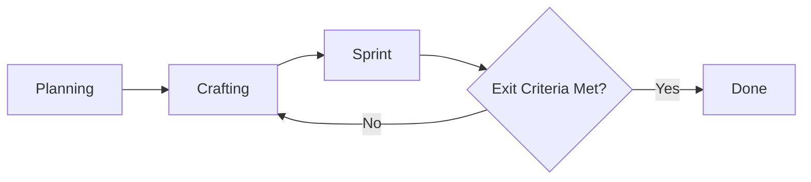

# Distribution Center (DC) - Implementation Planning Document

**Version**: 1.0  
**Last Updated**: 3 Mar 2026  
**Owner**: IT Strategy & Integration  
**Status**: Draft [Draft / In Review / Approved]

---

## 1. Project Overview

### 1.1 Problem Statement
> What problem are we solving? Why now?

### 1.2 Success Metrics (OKRs / KPIs)
| Type | Metric | Target |
|-|-|-|
| Outcome | [e.g., Reduce user onboarding time] | [e.g., -40%] |
| Output | [e.g., Ship MVP with 3 core features] | [e.g., by Q3] |
| Quality | [e.g., Critical bug rate post-release] | [e.g., < 1%] |

### 1.3 Stakeholders
| Role | Name | Responsibilities |
|-|-|-|
| Product Owner | [Name] | Prioritizes scope, approves Acceptance Criteria |
| Tech Lead | [Name] | Owns Definition of Done, technical feasibility |
| Project Sponsor | [Name] | Approves budget/timeline changes, gate decisions |
| Team | [Names] | Execute Crafting + Sprint cycles |

---

# 2. Scope Management

## 2.1 Minimum Viable Product (MVP)
> The smallest set of features that delivers measurable value and allows learning.

### MVP In-Scope
- [ ] **[Feature A]**: [Brief description + business value]
- [ ] **[Feature B]**: [Brief description + business value]
- [ ] **[Non-functional]**: [e.g., "Works on Chrome/Firefox", "API response <500ms"]

### MVP Out-of-Scope (Explicitly Excluded)
- [ ] [Nice-to-have X]
- [ ] [Future enhancement Y]
- [ ] [Platform Z support]

### MVP Exit Trigger
> When MVP scope is met + Acceptance Criteria pass → Move to "Done (v1)"


## 2.2 Acceptance Criteria (AC)
> Customer-facing conditions that define "valuable and usable". Written per feature/user story.

### Format (Given/When/Then recommended)
```gherkin
Feature: User Login
  Scenario: Successful login with valid credentials
    Given user is on login page
    When user enters valid email/password and clicks "Login"
    Then user is redirected to dashboard
    And session token is stored securely
```
AC Management
Stored in: [Jira / Linear / Notion / Wiki]
Reviewed by: Product Owner + QA before each Sprint
Changed via: [Change request process / Sprint refinement]

## 2.3 Definition of Done (DoD)
Team-facing quality checklist. Applied to every [Crafting -> Sprint] loop iteration AND final release.
- Per-Iteration DoD (Sprint Exit)
  + Code reviewed & merged to main branch
  + Unit tests written + passing (>80% coverage)
  + Integration tests green
  + Linting/formatting checks pass
  + Documentation updated (code comments + README)
  + Deployed to staging environment
  + Manual smoke test passed by QA
- Final Release DoD (Project Exit → "Done")
  + All MVP Acceptance Criteria verified
  + UAT signed off by Product Owner / Stakeholder
  + Performance benchmarks met ([specify])
  + Security scan completed, no critical vulnerabilities
  + Rollback plan documented
  + Support/ops handoff completed
  + Release notes published

---

# 3. Workflow & Process Design
## 3.1 High-Level Workflow


## 3.2 Iteration Rules for [Crafting -> Sprint]* Loop
| Rule | Description |
|-|-|
| Time-Box | Each Sprint cycle ≤ [X] days (e.g., 3-5 day sprint) |
| Loop Limit | Max [N] iterations before mandatory review (prevents infinite loop) |
| Decision Point | After each Sprint: PO + Tech Lead decide: Continue / Pivot / Stop |
| Scope Guardrail | New requirements mid-Sprint go to backlog, not current cycle |

## 3.3 Roles in the Loop
| Phase | Primary Roles | Output |
|-|-|-|
| Crafting | Designer + Architect + PO | Approved spec/mockup/technical design |
| Sprint | Dev + QA | Tested, integrated increment ready for review |
| Review | Whole team + PO | Go/No-Go decision to next loop or Done |

---
# 4. Timeline & Forecasting (Managing Uncertainty)
## 4.1 Planning Approach
+ Fixed Scope, Variable Time (Agile)
+ Fixed Time, Variable Scope (Time-boxed MVP)
+ Hybrid: [Describe]
## 4.2 Forecasting Method
+ Initial Estimate: [Best/Worst/Most Likely] cycles for [Crafting->Sprint]*
+ Re-forecast Cadence: After every [N] Sprints, update timeline
+ Tool: [Monte Carlo simulation / Velocity tracking / Burn-up chart]
## 4.3 Milestones (Not Fixed Dates)
| Milestone | Trigger Condition | Target Window |
| - | - | - |
| MVP Ready | All MVP AC + DoD met | Week 4-6 |
| Beta Release | UAT passed + performance OK | Week 7-9 |
| GA Launch | Support handoff + monitoring live | Week 10-12 |

---
# 5. Risk & Change Management
## 5.1 Known Risks for Recursive Workflow
| Risk | Mitigation | Owner |
| - | - | - |
| Loop fatigue / scope creep | Enforce iteration limits + backlog grooming | PO |
| Unclear exit criteria | Co-create DoD/AC upfront; review in refinement | Tech Lead |
| Stakeholder impatience | Communicate probabilistic forecasts; demo early | Project Manager |
| Technical debt accumulation | Allocate 10-20% of each Sprint to refactoring | Tech Lead |

## 5.2 Change Control
+ New scope during Sprint → Added to Backlog, not current iteration
+ Critical change mid-Sprint → Requires Gate Review (Sponsor + PO + Tech Lead)
+ DoD/AC changes → Must be documented + team-aligned before next cycle

---
# 6. Metrics & Visibility
## 6.1 Tracking Metrics
| Metric | Purpose | Target |
| - | - | - |
| Cycle Time (Crafting→Sprint) | Predict loop duration | < [X] days |
| Loop Count per Feature | Identify complexity hotspots | ≤ [N] iterations |
| Escape Defect Rate | Measure DoD effectiveness | < [Y]% |
| Stakeholder Satisfaction | Validate value delivery | ≥ [Z]/10| |
| Velocity | Track team throughput over time | Stable or improving |

## 6.2 Reporting Cadence
+ Daily: Standup (blockers in loop)
+ Per-Sprint: Demo + Retrospective
+ Weekly: Forecast update to stakeholders
+ Gate Reviews: At major milestones (Planning → Loop Entry → Done)

---
# 7. Approval & Sign-off

| Role | Name | Signature | Date |
| - | - | - | - |
| Product Owner | | | |
| Tech Lead | | | |
| Project Sponsor | | | |
| QA Lead | | | |

> + This document is living. Review & update after each major iteration or gate.
> + Change Log: Track significant updates to scope, AC, or DoD here.

---

# Appendix: Quick Reference
### Glossary
| Term | Definition |
| - | - |
| Crafting | Design, architecture, prototyping, specification work |
| Sprint | Time-boxed execution cycle to produce a testable increment |
| Exit Criteria | Conditions that must be met to leave a phase or loop |
| DoD | Definition of Done: team quality checklist |
| AC | Acceptance Criteria: customer-facing validation rules |

### Tool Stack Suggestions
| Purpose | Tool Examples |
|-|-|
|Backlog + AC | Jira, Linear, ClickUp, GitHub Issues|
|DoD Checklist | GitHub PR templates, Notion, Wiki|
|Workflow Visualization | Miro, Mural, physical Kanban, GitHub Projects|
|Forecasting | ActionableAgile, Monte Carlo tools, spreadsheets|
|Documentation | Notion, Confluence, GitBook, Markdown in repo|

### Emergency Escape Hatches
If the [Crafting -> Sprint]* loop stalls:  
1. Pause & Retrospect: What's blocking progress?
2. Simplify Scope: Can we reduce AC to unblock?
3. Spike Solution: Time-box a research task to de-risk
4. Escalate: Bring in additional expertise or decision-maker

