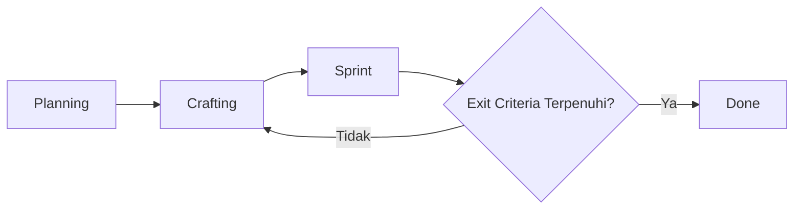

<!--
aksara:true
type:documents
meta:
    title:Office Facility Management (OFM)
    subtitle:Dokumen Perencanaan Implementasi
    author: Heriawan
    docNumber: DP-2026-001
style: ../assets/style.css
header: ${meta.title} | | 
footer: *${meta.subtitle}* | *${meta.docNumber}* | [page] / [total]
-->

## ${meta.subtitle}

# ${meta.title} 

**Version**: 1.0  
**Last Updated**: 3 Mar 2026  
**Owner**: IT Development  
**Status**: Draft *[Draft / In Review / Approved]*

---

# 1. Project Overview

## 1.1 Problem Statement
> Masalah apa yang kita selesaikan? Mengapa sekarang?
OFM adalah sistem terpusat berbasis web untuk mengelola transportasi karyawan, ruang rapat, dan fasilitas kantor dalam lingkungan perusahaan multi-entitas.

1. **Memusatkan operasional kantor** - Satu platform untuk permintaan transportasi, pemesanan ruang rapat, dan permintaan fasilitas/perlengkapan di seluruh entitas dan lokasi
2. **Mengaktifkan layanan mandiri** - Karyawan meminta sumber daya secara langsung; admin menyetujui dan mengelola melalui dashboard
3. **Meningkatkan visibilitas** - Pelacakan real-time kendaraan, ketersediaan ruangan, dan pemanfaatan sumber daya
4. **Mendukung multi-entitas** - Perusahaan holding dengan anak perusahaan, cakupan regional, pelaporan terkonsolidasi
5. **Mengurangi pekerjaan manual** - Alur kerja persetujuan otomatis, penugasan pengemudi, alokasi voucher, dan sinkronisasi karyawan dari SSO

### 1.2 Success Metrics (OKR / KPI)
| Type | Metric | Target |
|-|-|-|
| Output | Semua MVP terkirim | Jul 2026 |
| Quality | Tingkat bug kritis pasca-rilis | < 2% |
| Outcome | Efisiensi: SSO, SCIM (Lampiran B) | 80% |

### 1.3 Stakeholders
| Role | Responsibilities |
|-|-|
| Product Owner | Memprioritaskan cakupan, menyetujui Acceptance Criteria |
| Project Manager | Mengomunikasikan forecast probabilistik, menyetujui Acceptance Criteria |
| Tech Lead | Memiliki Definition of Done, kelayakan teknis |
| Team | Menjalankan siklus Crafting + Sprint |

---

## 2. Scope Management

## 2.1 Minimum Viable Product (MVP)
> Set fitur terkecil yang memberikan nilai terukur dan memungkinkan pembelajaran.

### MVP In-Scope
- **Meeting Room Booking**:
  * Reservasi ruangan
  * Dukungan rapat online/offline/hybrid
- **Transportation Management**:
  * Reservasi transportasi
  * Penjadwalan mobil perusahaan dengan penugasan pengemudi
  * Alokasi voucher (Gojek, Grab, dll.)
- **Multi-Entity Support**: Sesuai untuk perusahaan holding dengan anak perusahaan
- **SSO**: [Deskripsi singkat + nilai bisnis]
- **SCIM**: [Deskripsi singkat + nilai bisnis]
- **[Non-functional]**: [mis., "Berfungsi di Chrome/Firefox", "Respons API <500ms"]
- **Display Device**: Berfungsi di Browser Perangkat Display

### MVP Out-of-Scope (Explicitly Excluded)
- [x] Permintaan Fasilitas/Perlengkapan (Nice to have)
- [x] Aplikasi Android (Program Tahun Depan)
- [x] Pengembangan IoT Kustom

### MVP Exit Trigger
> Ketika cakupan MVP terpenuhi + Acceptance Criteria lulus → Pindah ke "Done"

---
## 2.2 Acceptance Criteria (AC)
* Meeting Room Booking
* Transportation Management
* Multi-Entity Support
* SSO
  - Login SSO berhasil
* SCIM

* Display Device
  - Perangkat dapat menjalankan aplikasi
  - Device Assignment [AC/MVC_Track](docs/ofm_AC_MVP.md#device-assignment)
  - Perangkat Dapat Menampilkan Informasi Ruangan

**Status terkini:** Lihat [`docs/AC_MVP.md`](docs/ofm_AC_MVP.md#acceptance-criteria)

---
## 2.3 Definition of Done (DoD)
Daftar periksa kualitas untuk tim. Diterapkan pada setiap iterasi loop [Crafting -> Sprint] DAN rilis final.
- DoD Per-Iterasi (Sprint Exit)
  + Kode ditinjau & digabungkan ke branch main
  + Unit test ditulis + lulus (>80% cakupan)
  + Integration test hijau
  + Pemeriksaan linting/formatting lulus
  + Dokumentasi diperbarui (komentar kode + README)
  + Di-deploy ke environment staging
  + Tes smoke manual lulus oleh QA

- DoD Rilis Final (Project Exit → "Done")
  + Semua Acceptance Criteria MVP diverifikasi
  + UAT ditandatangani oleh Product Owner / Stakeholder
  + Benchmark kinerja terpenuhi ([spesifik])
  + Pemindaian keamanan selesai, tidak ada kerentanan kritis
  + Rencana rollback terdokumentasi
  + Serah terima dukungan/ops selesai
  + Catatan rilis dipublikasikan

---

# 3. Workflow & Process Design
## 3.1 High-Level Workflow

## 3.2 Roles in the Loop
| Phase | Primary Roles | Output |
|-|-|-|
| Crafting | Designer + Architect + Product Owner | Spesifikasi/mockup/desain teknis yang disetujui |
| Sprint | Dev + QA | Inkremen teruji, terintegrasi, siap untuk tinjauan |
| Review | Product Owner + Tech Lead | Keputusan Go/No-Go ke loop berikutnya atau Done |

---

# 4. Timeline & Forecasting (Managing Uncertainty)

## 4.1 Planning Approach
- MVP scope tidak berubah tanpa Gate Review
- Perubahan kecil (UI adjustment, minor refinement) dapat memperpanjang timeline
- Perubahan besar (fitur baru, perubahan AC) masuk backlog post-MVP

## 4.2 Change Impact on Timeline
| Change Type | Example | Impact | Approval |
|-------------|---------|--------|----------|
| Minor | UI adjustment, copy change, color tweak | 20 Weeks | Tech Lead |
| Medium | Workflow adjustment, new field, report format | +Timeline + review scope | Product Owner + Tech Lead |
| Major | New feature, integration change, AC change | Backlog atau Gate Review | Product Owner + Project Manager |

## 4.3 Milestones (Adjustable Based on Changes)
| Milestone | Sprint | Trigger Condition | Target Window |
| - | - | - | - |
| MVP Ready | Sprint 1-10 | Semua AC + DoD MVP terpenuhi | Minggu 10-11 |
| Beta Release | Sprint 11-13 | UAT lulus + kinerja OK | Minggu 13-14 |
| General Availability Launch | Sprint 14-15 | Serah terima dukungan + monitoring aktif | Minggu 15-16 |

---

# 5. Iteration Configuration
Konfigurasi dan aturan untuk loop [Crafting -> Sprint]*. Diterapkan secara konsisten di seluruh siklus pengembangan.

## 5.1 Iteration Rules
| Rule | Description |
|-|-|
| Time-Box | Setiap siklus Sprint = 5 hari (1 minggu kerja) |
| Loop Limit | Maksimal 15 sprints untuk MVP |
| Decision Point | Setelah setiap Sprint: Product Owner + Tech Lead memutuskan: Lanjut / Pivot / Berhenti |
| Scope Guardrail | Persyaratan baru di tengah Sprint masuk backlog, bukan siklus saat ini |

## 5.2 Forecasting Method
+ Initial Estimate: 15 sprints menuju pemenuhan MVP
+ Re-forecast Cadence: Setelah setiap 3 sprints, update timeline
+ Tool: Burnup chart + velocity tracking

## 5.3 Tracking Metrics
| Metric | Purpose | Target |
| - | - | - |
| Cycle Time (Crafting→Sprint) | Memprediksi durasi loop | 5 hari/sprint |
| Loop Count per Feature | Identifikasi hotspots kompleksitas | ≤ 3 iterasi |
| Escape Defect Rate | Ukur efektivitas DoD | < 5% |
| Stakeholder Satisfaction | Validasi pengiriman nilai | ≥ 8/10 |
| Velocity | Lacak throughput per sprint | 5 hari (stable) |

## 5.4 Reporting Cadence
+ Per-Sprint: Demo + Retrospektif
+ Gate Reviews: Sprint 3, 6, 9, 12, 15 (milestone check)

---

# 6. Risk & Change Management
## 6.1 Known Risks for Recursive Workflow
| Risk | Mitigation | Owner |
| - | - | - |
| Loop fatigue / scope creep | Terapkan batas iterasi + grooming backlog | Product Owner |
| Stakeholder impatience | Komunikasikan forecast probabilistik; demo sejak dini | Project Manager |
| Unclear exit criteria | Buat DoD/AC bersama di awal; tinjau dalam penyempurnaan | Tech Lead |
| Technical debt accumulation | Alokasikan 10-20% setiap Sprint untuk refactoring | Tech Lead |

## 6.2 Change Control
+ Cakupan baru selama Sprint → Ditambahkan ke Backlog, bukan iterasi saat ini
+ Perubahan kritis di tengah Sprint → Memerlukan Gate Review (Product Owner + Project Manager + Tech Lead)
+ Perubahan DoD/AC → Harus terdokumentasi + selaras sebelum siklus berikutnya

---

# Approval

| Role | Name | Signature | Date |
| - | - | - | - |
| Product Owner | General Affairs | . | . |
| Project Manager | IT Development Div Head | . | . |
| Tech Lead | Heriawan | . | . |
| QA Lead | IT Development | . | . |

---

## **Appendix**: Quick Reference
### A. Glossary
|**Term**|**Definition**|
| - | - |
| Crafting | Desain, arsitektur, pembuatan prototipe, pekerjaan spesifikasi |
| Sprint | Siklus eksekusi time-boxed untuk menghasilkan inkremen yang dapat diuji |
| Exit Criteria | Kondisi yang harus dipenuhi untuk keluar dari fase atau loop |
| DoD | Definition of Done: daftar periksa kualitas tim |
| AC | Acceptance Criteria: aturan validasi yang dihadapi pelanggan |

### B. SSO/SCIM Efficiency Calculation
Max Saveable = 256.4 − 25.6          = 230.8
Actual Saved = 256.4 − 70            = 186.4
Efficiency % = (186.4 ÷ 230.8) × 100 = **80%**

|**Baseline Estimates (Manual Approach)**|**Estimated Hours**|
|-|-|
| Build custom auth | 160 (20 hari) |
| Annual auth maintenance | 56 (7 hari)  |
| Manual onboarding (1 users) | 0.2 |
| Manual offboarding (1 users) | 0.2 |
| Org structure changes (1/yr) | 40 |
| **Total Baseline** | 256.4 jam |

---

|**Actual Hours (With SSO/SCIM)**|**Actual Hours Spent**|
|-|-|
| SSO integration + config | 35 |
| SCIM setup + mapping | 20 |
| Ongoing maintenance (period) | 10 |
| Manual interventions (exceptions) | 5 |
| **Total Actual** | 70 |

### C. Administrative Deliverable
1. **Planning** (dokumen ini) : Alur kerja, cakupan, timeline, risiko
2. **MVP dan AC** [`docs/ofm_AC_MVP.md`](docs/ofm_AC_MVP.md): Daftar scope MVP dan AC
3. **Release Runbook** [`docs/ofm_Runbook.md`]: Panduan untuk pengoperasian produk
4. **Test Result** [`docs/ofm_Test.md`]: validasi pengujian
5. **UAT Signoff** [`docs/ofm_UAT.md`]: Bukti penerimaan Stakeholder
6. **Post Launch Review** : Pembelajaran untuk project selanjutnya (opsional)
