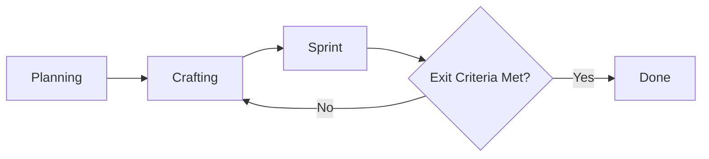

# Office Facility Management (OFM) - Implementation Planning Document

**Version**: 1.0  
**Last Updated**: 3 Mar 2026  
**Owner**: IT Development  
**Status**: Draft [Draft / In Review / Approved]

---

# 1. Project Overview

## 1.1 Problem Statement
> What problem are we solving? Why now?
OFM is a unified web-based system for managing employee transportation, meeting rooms, and office facilities within a multi-entity corporate environment.

1. **Centralize office operations** - Single platform for transportation requests, meeting room bookings, and facility/supply requests across all entities and locations
2. **Enable self-service** - Employees request resources directly; admins approve and manage via dashboard
3. **Improve visibility** - Real-time tracking of vehicles, room availability, and resource utilization
4. **Support multi-entity** - Holding company with subsidiaries, regional scoping, consolidated reporting
5. **Reduce manual work** - Automated approval workflows, driver assignment, voucher allocation, and employee sync from SSO

### 1.2 Success Metrics (OKRs / KPIs)
| Type | Metric | Target |
|-|-|-|
| Output | all MVP delivered  | Jul 2026 |
| Quality | Critical bug rate post-release | [e.g., < 1%] |
| Outcome | Efficiency: SSO, SCIM (Appendix B)  | 80% |

### 1.3 Stakeholders
| Role | Name | Responsibilities |
|-|-|-|
| Product Owner | Prioritizes scope, approves Acceptance Criteria |
| Project Manager | Communicate probabilistic forecasts, approves Acceptance Criteria |
| Tech Lead | Owns Definition of Done, technical feasibility |
| Team | Execute Crafting + Sprint cycles |

---

## 2. Scope Management

## 2.1 Minimum Viable Product (MVP)
> The smallest set of features that delivers measurable value and allows learning.

### MVP In-Scope
- **Meeting Room Booking**: 
  * Room reservation
  * Online/offline/hybrid meeting support
- **Transportation Management**: 
  * Transportation reservation 
  * Company car scheduling with driver assignment
  * Voucher allocation (Gojek, Grab, etc.)
- **Multi-Entity Support**: Fit for holding company with subsidiaries
- **SSO**: [Brief description + business value]
- **SCIM**: [Brief description + business value]
- **[Non-functional]**: [e.g., "Works on Chrome/Firefox", "API response <500ms"]
- **Display Device**: Works on Display Device Browser

Project tracking see: [AC_MVP.md#Minimum Viable Product (MVP)](docs/AC_MVP.md)  

### MVP Out-of-Scope (Explicitly Excluded)
- [x] Facility/Supply Requests (Nice to have)
- [x] Android Application (Next Year Program)
- [x] Custom IoT Development

### MVP Exit Trigger
> When MVP scope is met + Acceptance Criteria pass → Move to "Done"

## 2.2 Acceptance Criteria (AC)
* Meeting Room Booking
* Transportation Management
* Multi-Entity Support
* SSO
  - Successful SSO login
* SCIM 

* Display Device
  - Device can run application 
  - Device Assignment [AC/MVC_Track](docs/AC_MVP.md#device-assignment)
  - Device Can Display Room Information   

Stored in: [AC_MVP.md#Acceptance Criteria](docs/AC_MVP.md#acceptance-criteria)  
Reviewed by: Product Owner + QA before each Sprint
Changed via: [Change request process / Sprint refinement]

## 2.3 Definition of Done (DoD)
Team-facing quality checklist. Applied to every [Crafting -> Sprint] loop iteration AND final release.
- Per-Iteration DoD (Sprint Exit)
  + Code reviewed & merged to main branch
  + Unit tests written + passing (>80% coverage)
  + Integration tests green
  + Linting/formatting checks pass
  + Documentation updated (code comments + README)
  + Deployed to staging environment
  + Manual smoke test passed by QA

- Final Release DoD (Project Exit → "Done")
  + All MVP Acceptance Criteria verified
  + UAT signed off by Product Owner / Stakeholder
  + Performance benchmarks met ([specify])
  + Security scan completed, no critical vulnerabilities
  + Rollback plan documented
  + Support/ops handoff completed
  + Release notes published

---

# 3. Workflow & Process Design
## 3.1 High-Level Workflow

## 3.2 Iteration Rules for [Crafting -> Sprint]* Loop
| Rule | Description |
|-|-|
| Time-Box | Each Sprint cycle ≤ [X] days (e.g., 3-5 day sprint) |
| Loop Limit | Max [N] iterations before mandatory review (prevents infinite loop) |
| Decision Point | After each Sprint: PO + Tech Lead decide: Continue / Pivot / Stop |
| Scope Guardrail | New requirements mid-Sprint go to backlog, not current cycle |

## 3.3 Roles in the Loop
| Phase | Primary Roles | Output |
|-|-|-|
| Crafting | Designer + Architect + PO | Approved spec/mockup/technical design |
| Sprint | Dev + QA | Tested, integrated increment ready for review |
| Review | Whole team + PO | Go/No-Go decision to next loop or Done |

---

# 4. Timeline & Forecasting (Managing Uncertainty)
## 4.1 Planning Approach
+ Fixed Scope, Variable Time (Agile)
+ Fixed Time, Variable Scope (Time-boxed MVP)
+ Hybrid: [Describe]

## 4.2 Forecasting Method
+ Initial Estimate: [Best/Worst/Most Likely] cycles for [Crafting->Sprint]*
+ Re-forecast Cadence: After every [N] Sprints, update timeline
+ Tool: [Monte Carlo simulation / Velocity tracking / Burn-up chart]

## 4.3 Milestones (Not Fixed Dates)
| Milestone | Trigger Condition | Target Window |
| - | - | - |
| MVP Ready | All MVP AC + DoD met | Week 4-6 |
| Beta Release | UAT passed + performance OK | Week 7-9 |
| General Availability Launch | Support handoff + monitoring live | Week 10-12 |

---

# 5. Risk & Change Management
## 5.1 Known Risks for Recursive Workflow
| Risk | Mitigation | Owner |
| - | - | - |
| Loop fatigue / scope creep | Enforce iteration limits + backlog grooming | PO |
| Unclear exit criteria | Co-create DoD/AC upfront; review in refinement | Tech Lead |
| Stakeholder impatience | Communicate probabilistic forecasts; demo early | Project Manager |
| Technical debt accumulation | Allocate 10-20% of each Sprint to refactoring | Tech Lead |

## 5.2 Change Control
+ New scope during Sprint → Added to Backlog, not current iteration
+ Critical change mid-Sprint → Requires Gate Review (Sponsor + PO + Tech Lead)
+ DoD/AC changes → Must be documented + team-aligned before next cycle

---

# 6. Metrics & Visibility
## 6.1 Tracking Metrics
| Metric | Purpose | Target |
| - | - | - |
| Cycle Time (Crafting→Sprint) | Predict loop duration | < [X] days |
| Loop Count per Feature | Identify complexity hotspots | ≤ [N] iterations |
| Escape Defect Rate | Measure DoD effectiveness | < [Y]% |
| Stakeholder Satisfaction | Validate value delivery | ≥ [Z]/10| |
| Velocity | Track team throughput over time | Stable or improving |

## 6.2 Reporting Cadence
+ Daily: Standup (blockers in loop)
+ Per-Sprint: Demo + Retrospective
+ Weekly: Forecast update to stakeholders
+ Gate Reviews: At major milestones (Planning → Loop Entry → Done)

---

# 7. Approval & Sign-off

| Role | Name | Signature | Date |
| - | - | - | - |
| Product Owner | General Affairs | | |
| Project Manager | IT Development Div Head | | |
| Tech Lead | Heriawan | | |
| QA Lead | IT Development | | |

> + This document is living. Review & update after each major iteration or gate.
> + Change Log: Track significant updates to scope, AC, or DoD here.

---

# Appendix: Quick Reference
### A. Glossary
| Term | Definition |
| - | - |
| Crafting | Design, architecture, prototyping, specification work |
| Sprint | Time-boxed execution cycle to produce a testable increment |
| Exit Criteria | Conditions that must be met to leave a phase or loop |
| DoD | Definition of Done: team quality checklist |
| AC | Acceptance Criteria: customer-facing validation rules |

### B. SSO/SCIM Efficiency Calculation
Max Saveable = 256.4 − 25,6          = 230.8  
Actual Saved = 256.4 − 70            = 186.4  
Efficiency % = (186.4 ÷ 230.8) × 100 = **80%**

1. Baseline Estimates (Manual Approach)

|Activity|Estimated Hours|
|-|-|
| Build custom auth | 160 (20 days) |
| Annual auth maintenance | 56 (7 days)  |
| Manual onboarding (1 users) | 0.2 |
| Manual offboarding (1 users) | 0.2 |
| Org structure changes (1/yr) | 40 |
| **Total Baseline** | 256.4 hrs |

2. Actual Hours (With SSO/SCIM)

|Activity|Actual Hours Spent|
|-|-|
| SSO integration + config | 35 |
| SCIM setup + mapping | 20 |
| Ongoing maintenance (period) | 10 |
| Manual interventions (exceptions) | 5 |
| **Total Actual** | 70 |

### C. Administratives Deliverable
1. **Planning (this Documents)** : Workflow, scope, timeline, risk
2. **MVP and AC** [docs/AC_MVP.md in repo]: Proof of WHAT was delivered (Checklist of scope + AC)
3. **Release Runbook** [docs/Runbook.md in repo]: Guide for OPERATING the product
4. **Test Result** [docs/Test.md in repo]: Proof of HOW it was validated (test evidence)
5. **UAT_Signoff** : Proof of STAKEHOLDER acceptance
6. **Post_Launch_Review** : Learnings for NEXT time (optional)
