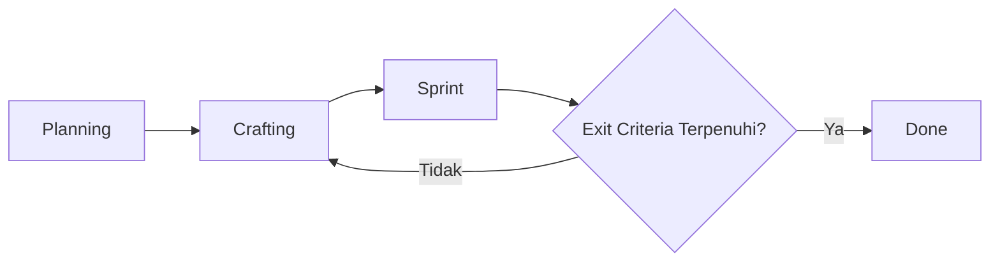

# Single Sign-On (SSO) - Dokumen Perencanaan Implementasi

**Version**: 1.0  
**Last Updated**: 3 Mar 2026  
**Owner**: IT Infrastructure & Operation  
**Status**: Draft [Draft / In Review / Approved]

---

# 1. Project Overview

## 1.1 Problem Statement
> Masalah apa yang kita selesaikan? Mengapa sekarang?
SSO adalah solusi autentikasi terpusat yang memungkinkan pengguna mengakses berbagai aplikasi dengan satu set kredensial, mengurangi password fatigue dan meningkatkan keamanan.

1. **Single Credential** - Satu login untuk semua aplikasi corporate
2. **Improved Security** - Centralized authentication, policy enforcement
3. **Reduced IT Overhead** - Less password reset requests, automated provisioning
4. **Better UX** - Seamless navigation between applications
5. **Compliance Ready** - Audit trail, access logging

### 1.2 Success Metrics (OKR / KPI)
| Type | Metric | Target |
|-|-|-|
| Output | SSO MVP delivered | [Target Date] |
| Quality | Authentication success rate | > 99.5% |
| Outcome | Reduce password-related tickets | -40% |

### 1.3 Stakeholders
| Role | Name | Responsibilities |
|-|-|-|
| Product Owner | Memprioritaskan cakupan, menyetujui Acceptance Criteria |
| Project Manager | Mengomunikasikan forecast probabilistik, menyetujui Acceptance Criteria |
| Tech Lead | Memiliki Definition of Done, kelayakan teknis |
| Team | Menjalankan siklus Crafting + Sprint |

---

## 2. Scope Management

## 2.1 Minimum Viable Product (MVP)
> Set fitur terkecil yang memberikan nilai terukur dan memungkinkan pembelajaran.

### MVP In-Scope
- **SSO Integration**:
  * SAML 2.0 / OIDC support
  * Corporate IdP integration (e.g., Azure AD, Okta)
  * Session management
- **User Provisioning**:
  * SCIM 2.0 support
  * Auto user creation/update/disable
- **Security**:
  * MFA support (via IdP)
  * Role-based access control
- **[Non-functional]**: [mis., "Auth response <2s", "99.9% uptime"]

**Status terkini:** Lihat [`docs/AC_MVP.md`](docs/sso_AC_MVP.md#minimum-viable-product-mvp)

### MVP Out-of-Scope (Explicitly Excluded)
- [x] Custom user database (use IdP only)
- [x] Social login (Google, Facebook, etc.)
- [x] Mobile app SSO (next phase)

### MVP Exit Trigger
> Ketika cakupan MVP terpenuhi + Acceptance Criteria lulus → Pindah ke "Done"

## 2.2 Acceptance Criteria (AC)
* SSO Login
  - Successful login with valid credentials
  - Failed login with invalid credentials
  - Session timeout handling
* SCIM Provisioning
  - User creation from IdP
  - User attribute sync
  - User deactivation
* Security
  - MFA enforcement (via IdP)
  - Session management
  - Logout (single & global)

**Status terkini:** Lihat [`docs/AC_MVP.md`](docs/sso_AC_MVP.md#acceptance-criteria)

## 2.3 Definition of Done (DoD)
Daftar periksa kualitas untuk tim. Diterapkan pada setiap iterasi loop [Crafting -> Sprint] DAN rilis final.
- DoD Per-Iterasi (Sprint Exit)
  + Kode ditinjau & digabungkan ke branch main
  + Unit test ditulis + lulus (>80% cakupan)
  + Integration test hijau
  + Pemeriksaan linting/formatting lulus
  + Dokumentasi diperbarui (komentar kode + README)
  + Di-deploy ke environment staging
  + Tes smoke manual lulus oleh QA

- DoD Rilis Final (Project Exit → "Done")
  + Semua Acceptance Criteria MVP diverifikasi
  + UAT ditandatangani oleh Product Owner / Stakeholder
  + Benchmark kinerja terpenuhi ([spesifik])
  + Pemindaian keamanan selesai, tidak ada kerentanan kritis
  + Rencana rollback terdokumentasi
  + Serah terima dukungan/ops selesai
  + Catatan rilis dipublikasikan

---

# 3. Workflow & Process Design
## 3.1 High-Level Workflow

## 3.2 Roles in the Loop
| Phase | Primary Roles | Output |
|-|-|-|
| Crafting | Designer + Architect + PO | Spesifikasi/mockup/desain teknis yang disetujui |
| Sprint | Dev + QA | Inkremen teruji, terintegrasi, siap untuk tinjauan |
| Review | PO + Tech Lead | Keputusan Go/No-Go ke loop berikutnya atau Done |

---

# 4. Timeline & Forecasting (Managing Uncertainty)

## 4.1 Planning Approach
- MVP scope tidak berubah tanpa Gate Review
- Perubahan kecil (UI adjustment, minor refinement) dapat memperpanjang timeline
- Perubahan besar (fitur baru, perubahan AC) masuk backlog post-MVP

## 4.2 Change Impact on Timeline
| Change Type | Example | Impact | Approval |
|-------------|---------|--------|----------|
| Minor | UI adjustment, copy change, color tweak | +Timeline (mandays tetap) | Tech Lead |
| Medium | Workflow adjustment, new field, report format | +Timeline + review scope | PO + Tech Lead |
| Major | New feature, integration change, AC change | Backlog atau Gate Review | Product Owner + Sponsor |

## 4.3 Milestones (Adjustable Based on Changes)
| Milestone | Sprint | Trigger Condition | Target Window |
| - | - | - | - |
| MVP Ready | Sprint 1-8 | Semua AC + DoD MVP terpenuhi | Minggu 8-9 |
| Beta Release | Sprint 9-10 | UAT lulus + kinerja OK | Minggu 10-11 |
| General Availability Launch | Sprint 11-12 | Serah terima dukungan + monitoring aktif | Minggu 12-13 |

> **Catatan:**
> - Target window dapat bergeser jika ada perubahan minor yang disetujui
> - Buffer ~1-2 minggu termasuk untuk UAT, fix, dan deployment

---

# 5. Iteration Configuration
Konfigurasi dan aturan untuk loop [Crafting -> Sprint]*. Diterapkan secara konsisten di seluruh siklus pengembangan.

## 5.1 Iteration Rules
| Rule | Description |
|-|-|
| Time-Box | Setiap siklus Sprint = 5 hari (1 minggu kerja) |
| Loop Limit | Maksimal 12 sprints untuk MVP |
| Decision Point | Setelah setiap Sprint: PO + Tech Lead memutuskan: Lanjut / Pivot / Berhenti |
| Scope Guardrail | Persyaratan baru di tengah Sprint masuk backlog, bukan siklus saat ini |

## 5.2 Forecasting Method
+ Initial Estimate: 12 sprints menuju pemenuhan MVP
+ Re-forecast Cadence: Setelah setiap 3 sprints, update timeline
+ Tool: Burnup chart + velocity tracking

## 5.3 Tracking Metrics
| Metric | Purpose | Target |
| - | - | - |
| Cycle Time (Crafting→Sprint) | Memprediksi durasi loop | 5 hari/sprint |
| Loop Count per Feature | Identifikasi titik panas kompleksitas | ≤ 3 iterasi |
| Escape Defect Rate | Ukur efektivitas DoD | < 5% |
| Stakeholder Satisfaction | Validasi pengiriman nilai | ≥ 8/10 |
| Velocity | Lacak throughput per sprint | 5 hari (stable) |

## 5.4 Reporting Cadence
+ Per-Sprint: Demo + Retrospektif (setiap Jumat)
+ Gate Reviews: Sprint 3, 6, 9, 12 (milestone check)

---

# 6. Risk & Change Management
## 6.1 Known Risks for Recursive Workflow
| Risk | Mitigation | Owner |
| - | - | - |
| IdP integration complexity | Early POC with IdP vendor | Tech Lead |
| Certificate/key management | Secure storage, rotation policy | Tech Lead |
| Stakeholder impatience | Komunikasikan forecast probabilistik; demo sejak dini | Project Manager |
| Session security issues | Security review, penetration testing | Tech Lead |

## 6.2 Change Control
+ Cakupan baru selama Sprint → Ditambahkan ke Backlog, bukan iterasi saat ini
+ Perubahan kritis di tengah Sprint → Memerlukan Gate Review (Product Owner + Project Manager + Tech Lead)
+ Perubahan DoD/AC → Harus terdokumentasi + selaras sebelum siklus berikutnya

---

# 7. Approval & Sign-off

| Role | Name | Signature | Date |
| - | - | - | - |
| Product Owner | IT Infrastructure | | |
| Project Manager | IT Operation Div Head | | |
| Tech Lead | [Name] | | |
| QA Lead | IT Development | | |

> + Dokumen ini adalah **snapshot statis** dari perencanaan awal.
> + Untuk status terkini, lihat dokumen di [`docs/`](docs/).

---

# Appendix: Quick Reference
### A. Glossary
| Term | Definition |
| - | - |
| SSO | Single Sign-On - autentikasi tunggal untuk multiple aplikasi |
| IdP | Identity Provider - penyedia identitas (e.g., Azure AD, Okta) |
| SAML | Security Assertion Markup Language - protokol SSO |
| OIDC | OpenID Connect - modern authentication protocol |
| SCIM | System for Cross-domain Identity Management - user provisioning |
| Sprint | Siklus eksekusi time-boxed untuk menghasilkan inkremen yang dapat diuji |
| Exit Criteria | Kondisi yang harus dipenuhi untuk keluar dari fase atau loop |
| DoD | Definition of Done: daftar periksa kualitas tim |
| AC | Acceptance Criteria: aturan validasi yang dihadapi pelanggan |

### B. Technical References
| Standard | Purpose |
|----------|---------|
| SAML 2.0 | XML-based SSO protocol |
| OIDC/OAuth2 | Modern token-based authentication |
| SCIM 2.0 | Automated user provisioning |

### C. Administrative Deliverable
1. **Planning (dokumen ini)** : Alur kerja, cakupan, timeline, risiko
2. **MVP dan AC** [`docs/sso_AC_MVP.md`]: Daftar scope MVP dan AC
3. **Release Runbook** [`docs/sso_Runbook.md`]: Panduan untuk pengoperasian produk
4. **Test Result** [`docs/sso_Test.md`]: validasi pengujian
5. **UAT Signoff** [`docs/sso_UAT.md`]: Bukti penerimaan Stakeholder
6. **Post_Launch_Review** : Pembelajaran untuk project selanjutnya (opsional)