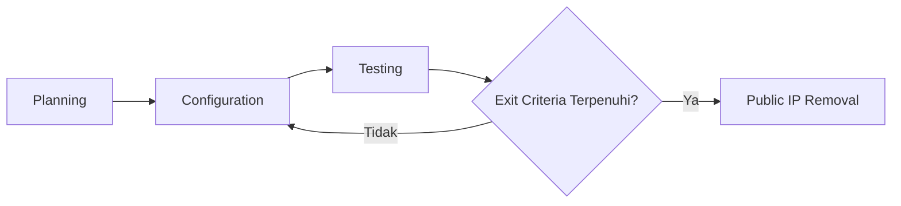

# Zero Trust Network Access (ZTNA) - Dokumen Implementasi

**Version**: 1.0  
**Last Updated**: 3 Mar 2026  
**Owner**: IT Infrastructure & Operation  
**Status**: Draft [Draft / In Review / Approved]

---

# 1. Project Overview

## 1.1 Problem Statement
> Masalah apa yang kita selesaikan? Mengapa sekarang?
ZTNA menggunakan Cloudflare Zero Trust untuk menggantikan akses jaringan tradisional berbasis perimeter. Karyawan dapat mengakses aplikasi web, RDP, SSH, dan layanan lainnya dari jaringan publik ke jaringan privat organisasi dengan aman, tanpa mengekspos server ke internet publik.

**Business Value:**
1. **Secure Remote Access** - Akses aman dari mana saja tanpa VPN tradisional
2. **Web Application Access** - Akses aplikasi web internal tanpa public IP
3. **RDP/SSH Gateway** - Akses server via RDP/SSH melalui Cloudflare Tunnel
4. **Host-to-Host Connectivity** - Koneksi antar server di isolated network
5. **Public IP Removal** - Menghapus eksposur server ke internet publik

## 1.2 Success Metrics (OKR / KPI)
| Type | Metric | Target |
|-|-|-|
| Output | ZTNA MVP deployed | [Target Date] |
| Quality | Connection success rate | > 99% |
| Outcome | Public IPs removed | 100% targeted servers |
| Security | Zero unauthorized access | 0 incidents |

## 1.3 Stakeholders
| Role | Name | Responsibilities |
|-|-|-|
| Product Owner | Memprioritaskan cakupan, menyetujui Acceptance Criteria |
| Project Manager | Mengomunikasikan progress, manage expectations |
| Tech Lead | Technical decisions, configuration review |
| Team | Menjalankan konfigurasi + testing |

---

## 2. Scope Management

## 2.1 Minimum Viable Product (MVP)
> Konfigurasi terkecil yang memberikan akses aman dan memungkinkan migrasi penuh.

### MVP In-Scope
- **Cloudflare Zero Trust Setup**:
  * Cloudflare Tunnel (cloudflared) deployment
  * Access Policies configuration
  * Service Tokens setup
- **Web Application Access**:
  * Internal web apps via Cloudflare Tunnel
  * Access policies per application
- **RDP/SSH Gateway**:
  * TCP tunnel untuk RDP (port 3389)
  * TCP tunnel untuk SSH (port 22)
  * Custom port support
- **Host-to-Host Connectivity**:
  * Tunnel untuk isolated network routing
  * Server-to-server access via Service Tokens
- **Public IP Removal**:
  * Identify servers with public IP
  * Migrate to Cloudflare Tunnel
  * Remove public IP assignment

**Status terkini:** Lihat [`docs/AC_MVP.md`](docs/ztna_AC_MVP.md#minimum-viable-product-mvp)

### MVP Out-of-Scope (Explicitly Excluded)
- [x] Legacy VPN infrastructure (akan di-decommission setelah migrasi)
- [x] On-premise hardware ZTNA appliances
- [x] Third-party integration beyond Cloudflare ecosystem

### MVP Exit Trigger
> Ketika semua konfigurasi MVP terpenuhi + Acceptance Criteria lulus → Public IP Removal dapat dimulai

## 2.2 Acceptance Criteria (AC)
* Web Application Access
  - User dapat akses aplikasi web internal via browser
  - Access policy enforced (SSO + device posture)
  - No public IP required on server
* RDP/SSH Access
  - User dapat RDP ke server via Cloudflare Tunnel
  - User dapat SSH ke server via Cloudflare Tunnel
  - Custom port forwarding functional
* Host-to-Host Connectivity
  - Server dapat communicate via Cloudflare Tunnel
  - Service Token authentication working
  - Isolated network routing functional
* Public IP Removal
  - All targeted servers accessible via ZTNA
  - Public IP can be safely removed
  - No service disruption

**Status terkini:** Lihat [`docs/AC_MVP.md`](docs/ztna_AC_MVP.md#acceptance-criteria)

## 2.3 Definition of Done (DoD)
Daftar periksa kualitas untuk tim. Diterapkan pada setiap fase konfigurasi DAN final deployment.

- DoD Per-Fase (Phase Exit)
  + Configuration reviewed & documented
  + Connectivity tests passing
  + Access policies tested
  + Rollback procedure documented
  + Monitoring enabled

- DoD Final Deployment (Project Exit → "Done")
  + Semua Acceptance Criteria MVP diverifikasi
  + UAT ditandatangani oleh Product Owner / Stakeholder
  + Public IP removal completed
  + Security validation passed
  + Runbook completed
  + Support handoff completed
  + Decommission old VPN (if applicable)

---

# 3. Workflow & Process Design
## 3.1 High-Level Workflow

## 3.2 Roles in the Loop
| Phase | Primary Roles | Output |
|-|-|-|
| Planning | Architect + PO | Design document, access policies |
| Configuration | Engineer | Cloudflare Tunnel, Access config |
| Testing | Engineer + QA | Test results, validation |
| Review | PO + Tech Lead | Go/No-Go decision |

---

# 4. Timeline & Forecasting (Managing Uncertainty)

## 4.1 Planning Approach
- MVP scope tidak berubah tanpa Gate Review
- Perubahan kecil (additional port, new app) dapat memperpanjang timeline
- Perubahan besar (new use case, different provider) masuk backlog post-MVP

## 4.2 Change Impact on Timeline
| Change Type | Example | Impact | Approval |
|-------------|---------|--------|----------|
| Minor | Add new port, new subdomain | +Timeline (mandays tetap) | Tech Lead |
| Medium | New application type, policy change | +Timeline + review scope | PO + Tech Lead |
| Major | Different ZTNA provider, architecture change | Backlog atau Gate Review | Product Owner + Sponsor |

## 4.3 Milestones (Adjustable Based on Changes)
| Milestone | Phase | Trigger Condition | Target Window |
| - | - | - | - |
| ZTNA Setup Complete | Phase 1-4 | Cloudflare Tunnel + Access configured | Minggu 4-5 |
| UAT Passed | Phase 5 | User acceptance testing complete | Minggu 6-7 |
| Public IP Removal | Phase 6 | All servers migrated, IPs removed | Minggu 8-9 |

> **Catatan:**
> - Target window dapat bergeser jika ada perubahan minor yang disetujui
> - Buffer ~1-2 minggu untuk troubleshooting dan rollback jika needed

---

# 5. Implementation Configuration
Konfigurasi dan aturan untuk implementasi ZTNA. Diterapkan secara konsisten di seluruh fase.

## 5.1 Phase Rules
| Rule | Description |
|-|-|
| Time-Box | Setiap fase = 5 hari (1 minggu kerja) |
| Phase Limit | Maksimal 9 phases untuk MVP |
| Decision Point | Setelah setiap fase: PO + Tech Lead memutuskan: Lanjut / Pivot / Berhenti |
| Scope Guardrail | Persyaratan baru di tengah fase masuk backlog, bukan siklus saat ini |

## 5.2 Implementation Phases (45 Mandays)
| Phase | Name | Mandays | Deliverables |
|-------|------|---------|--------------|
| 1 | Cloudflare Zero Trust Setup | 5 | Account, Team, Access setup |
| 2 | Cloudflare Tunnel - Web Apps | 5 | Tunnel deployed, web apps accessible |
| 3 | Cloudflare Tunnel - RDP/SSH | 5 | TCP tunnels for RDP/SSH |
| 4 | Host-to-Host Connectivity | 5 | Service tokens, isolated routing |
| 5 | UAT & Testing | 5 | User testing, validation |
| 6 | Public IP Removal - Wave 1 | 5 | First batch servers migrated |
| 7 | Public IP Removal - Wave 2 | 5 | Second batch servers migrated |
| 8 | Public IP Removal - Wave 3 | 5 | Final batch servers migrated |
| 9 | Hardening & Documentation | 5 | Runbook, monitoring, handoff |
| **Total** | | **45** | **ZTNA Complete** |

## 5.3 Forecasting Method
+ Initial Estimate: 9 phases menuju ZTNA complete
+ Re-forecast Cadence: Setelah setiap 3 phases, update timeline
+ Tool: Burnup chart + phase tracking

## 5.4 Tracking Metrics
| Metric | Purpose | Target |
| - | - | - |
| Phase Duration | Memprediksi durasi implementasi | 5 hari/phase |
| Servers Migrated | Track migration progress | 100% targeted |
| Connection Success Rate | Ukur kualitas konfigurasi | > 99% |
| Stakeholder Satisfaction | Validasi pengiriman nilai | ≥ 8/10 |

## 5.5 Reporting Cadence
+ Per-Phase: Demo + Retrospektif (setiap Jumat)
+ Gate Reviews: Phase 3, 6, 9 (milestone check)

---

# 6. Risk & Change Management
## 6.1 Known Risks
| Risk | Mitigation | Owner |
| - | - | - |
| Service disruption during IP removal | Phased approach, rollback ready | Tech Lead |
| Cloudflare Tunnel connectivity issues | Redundant tunnel deployment | Tech Lead |
| User access issues | Clear documentation, training | Project Manager |
| Compliance/audit concerns | Document access logs, policies | Tech Lead |

## 6.2 Change Control
+ Konfigurasi baru selama fase → Ditambahkan ke Backlog, bukan iterasi saat ini
+ Perubahan kritis di tengah fase → Memerlukan Gate Review (Product Owner + Project Manager + Tech Lead)
+ Perubahan DoD/AC → Harus terdokumentasi + selaras sebelum siklus berikutnya

---

# 7. Approval & Sign-off

| Role | Name | Signature | Date |
| - | - | - | - |
| Product Owner | IT Infrastructure | | |
| Project Manager | IT Operation Div Head | | |
| Tech Lead | [Name] | | |
| Security Lead | IT Security | | |

> + Dokumen ini adalah **snapshot statis** dari perencanaan awal.
> + Untuk status terkini, lihat dokumen di [`docs/`](docs/).

---

# Appendix: Quick Reference
### A. Glossary
| Term | Definition |
| - | - |
| ZTNA | Zero Trust Network Access - model keamanan "never trust, always verify" |
| Cloudflare Tunnel | Encrypted tunnel via cloudflared daemon |
| Access Policy | Rule yang menentukan siapa yang bisa akses aplikasi |
| Service Token | Token untuk server-to-server authentication |
| Public IP Removal | Proses menghapus IP publik dari server |
| Phase | Siklus implementasi time-boxed untuk menghasilkan konfigurasi yang dapat diuji |
| Exit Criteria | Kondisi yang harus dipenuhi untuk keluar dari fase |
| DoD | Definition of Done: daftar periksa kualitas tim |
| AC | Acceptance Criteria: aturan validasi yang dihadapi user |

### B. Technical Architecture
| Component | Purpose |
|-----------|---------|
| Cloudflare Zero Trust | ZTNA platform |
| cloudflared | Tunnel daemon |
| Access Gateway | Web app proxy |
| TCP Tunnel | RDP/SSH forwarding |
| Service Tokens | Machine authentication |

### C. Administrative Deliverable
1. **Planning (dokumen ini)** : Alur kerja, cakupan, timeline, risiko
2. **MVP dan AC** [`docs/ztna_AC_MVP.md`]: Daftar yang dikonfigurasi (Checklist scope + AC)
3. **Release Runbook** [`docs/ztna_Runbook.md`]: Panduan untuk pengoperasian ZTNA
4. **Test Result** [`docs/ztna_Test.md`]: validasi pengujian
5. **UAT Signoff** [`docs/ztna_UAT.md`]: Bukti penerimaan Stakeholder
6. **Post_Launch_Review** : Pembelajaran untuk projectselanjutnya (opsional)
