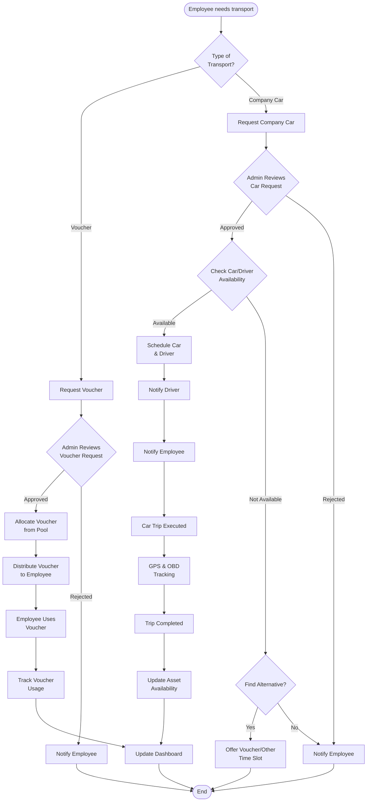
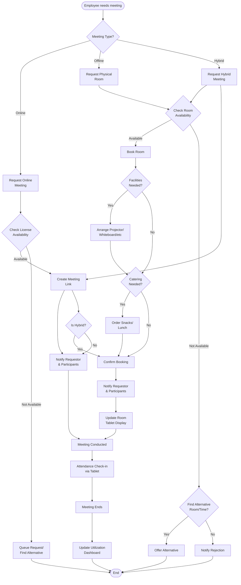
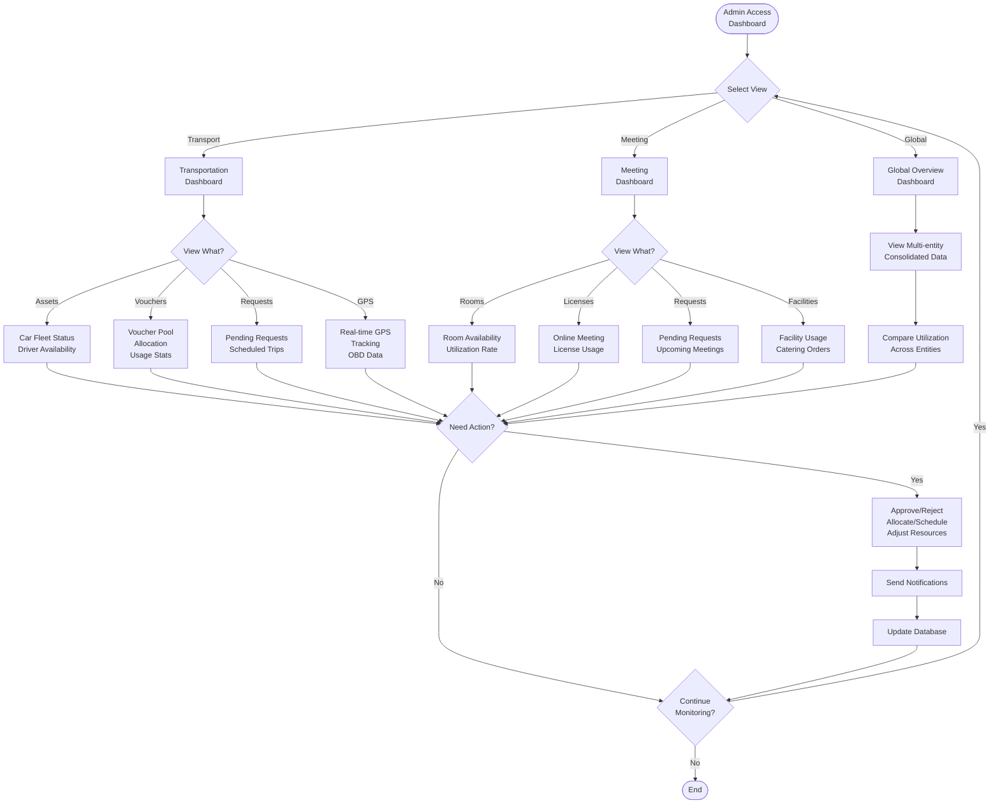

## 1. Employee Transportation Support Process

```mermaid
flowchart TD
    Start([Employee needs transport]) --> CheckType{Type of<br/>Transport?}

    CheckType -->|Voucher| ReqVoucher[Request Voucher]
    CheckType -->|Company Car| ReqCar[Request Company Car]

    ReqVoucher --> AdminReviewV{Admin Reviews<br/>Voucher Request}
    AdminReviewV -->|Approved| AllocateV[Allocate Voucher<br/>from Pool]
    AdminReviewV -->|Rejected| NotifyRejectV[Notify Employee]
    AllocateV --> DistributeV[Distribute Voucher<br/>to Employee]
    DistributeV --> UseV[Employee Uses<br/>Voucher]
    UseV --> TrackV[Track Voucher<br/>Usage]

    ReqCar --> AdminReviewC{Admin Reviews<br/>Car Request}
    AdminReviewC -->|Approved| CheckAvail{Check Car/Driver<br/>Availability}
    AdminReviewC -->|Rejected| NotifyRejectC[Notify Employee]
    CheckAvail -->|Available| ScheduleCar[Schedule Car<br/>& Driver]
    CheckAvail -->|Not Available| FindAlt{Find Alternative?}
    FindAlt -->|Yes| OfferAlt[Offer Voucher/Other<br/>Time Slot]
    FindAlt -->|No| NotifyRejectC
    ScheduleCar --> NotifyDriver[Notify Driver]
    NotifyDriver --> NotifyEmp[Notify Employee]
    NotifyEmp --> CarTrip[Car Trip Executed]
    CarTrip --> GPSTracking[GPS & OBD<br/>Tracking]
    GPSTracking --> TripComplete[Trip Completed]
    TripComplete --> UpdateAsset[Update Asset<br/>Availability]

    TrackV --> Dashboard[Update Dashboard]
    UpdateAsset --> Dashboard
    Dashboard --> End([End])
    NotifyRejectV --> End
    NotifyRejectC --> End
    OfferAlt --> End
```

## 2. Meeting Room Booking Process

```mermaid
flowchart TD
    Start([Employee needs meeting]) --> CheckMeetingType{Meeting Type?}

    CheckMeetingType -->|Online| ReqOnline[Request Online<br/>Meeting]
    CheckMeetingType -->|Offline| ReqOffline[Request Physical<br/>Room]
    CheckMeetingType -->|Hybrid| ReqHybrid[Request Hybrid<br/>Meeting]

    ReqOnline --> CheckLicense{Check License<br/>Availability}
    CheckLicense -->|Available| CreateLink[Create Meeting<br/>Link]
    CheckLicense -->|Not Available| QueueOnline[Queue Request/<br/>Find Alternative]
    CreateLink --> NotifyOnline[Notify Requestor<br/>& Participants]

    ReqOffline --> CheckRoom{Check Room<br/>Availability}
    ReqHybrid --> CheckRoom
    CheckRoom -->|Available| BookRoom[Book Room]
    CheckRoom -->|Not Available| FindAltRoom{Find Alternative<br/>Room/Time?}
    FindAltRoom -->|Yes| OfferAlt[Offer Alternative]
    FindAltRoom -->|No| NotifyReject[Notify Rejection]
    BookRoom --> CheckFacility{Facilities<br/>Needed?}
    CheckFacility -->|Yes| ArrangeFacility[Arrange Projector/<br/>Whiteboard/etc]
    CheckFacility -->|No| CheckCatering
    ArrangeFacility --> CheckCatering{Catering<br/>Needed?}
    CheckCatering -->|Yes| OrderCatering[Order Snacks/<br/>Lunch]
    CheckCatering -->|No| ConfirmBooking
    OrderCatering --> ConfirmBooking[Confirm Booking]

    ReqHybrid --> CreateLink
    ConfirmBooking --> NotifyAll[Notify Requestor<br/>& Participants]
    CreateLink --> SyncHybrid{Is Hybrid?}
    SyncHybrid -->|Yes| ConfirmBooking
    SyncHybrid -->|No| NotifyOnline

    NotifyAll --> UpdateTablet[Update Room<br/>Tablet Display]
    NotifyOnline --> Meeting[Meeting Conducted]
    UpdateTablet --> Meeting
    Meeting --> CheckIn[Attendance Check-in<br/>via Tablet]
    CheckIn --> MeetingEnd[Meeting Ends]
    MeetingEnd --> UpdateUtil[Update Utilization<br/>Dashboard]
    UpdateUtil --> End([End])

    QueueOnline --> End
    OfferAlt --> End
    NotifyReject --> End
```

## 3. Admin Dashboard & Monitoring Process

```mermaid
flowchart TD
    Start([Admin Access<br/>Dashboard]) --> SelectView{Select View}

    SelectView -->|Transport| TransDash[Transportation<br/>Dashboard]
    SelectView -->|Meeting| MeetDash[Meeting<br/>Dashboard]
    SelectView -->|Global| GlobalDash[Global Overview<br/>Dashboard]

    TransDash --> ViewTrans{View What?}
    ViewTrans -->|Assets| AssetView[Car Fleet Status<br/>Driver Availability]
    ViewTrans -->|Vouchers| VoucherView[Voucher Pool<br/>Allocation<br/>Usage Stats]
    ViewTrans -->|Requests| TransReqView[Pending Requests<br/>Scheduled Trips]
    ViewTrans -->|GPS| GPSView[Real-time GPS<br/>Tracking<br/>OBD Data]

    AssetView --> TakeAction{Need Action?}
    VoucherView --> TakeAction
    TransReqView --> TakeAction
    GPSView --> TakeAction

    MeetDash --> ViewMeet{View What?}
    ViewMeet -->|Rooms| RoomView[Room Availability<br/>Utilization Rate]
    ViewMeet -->|Licenses| LicenseView[Online Meeting<br/>License Usage]
    ViewMeet -->|Requests| MeetReqView[Pending Requests<br/>Upcoming Meetings]
    ViewMeet -->|Facilities| FacilityView[Facility Usage<br/>Catering Orders]

    RoomView --> TakeAction
    LicenseView --> TakeAction
    MeetReqView --> TakeAction
    FacilityView --> TakeAction

    GlobalDash --> MultiEntity[View Multi-entity<br/>Consolidated Data]
    MultiEntity --> CompareUtil[Compare Utilization<br/>Across Entities]
    CompareUtil --> TakeAction

    TakeAction -->|Yes| ProcessAction[Approve/Reject<br/>Allocate/Schedule<br/>Adjust Resources]
    TakeAction -->|No| Continue{Continue<br/>Monitoring?}
    ProcessAction --> Notify[Send Notifications]
    Notify --> UpdateDB[Update Database]
    UpdateDB --> Continue
    Continue -->|Yes| SelectView
    Continue -->|No| End([End])
```

**Last Updated:** 2025-11-05
