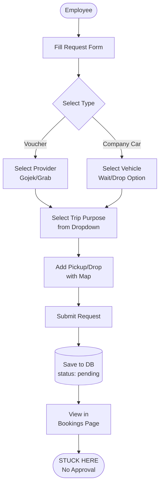
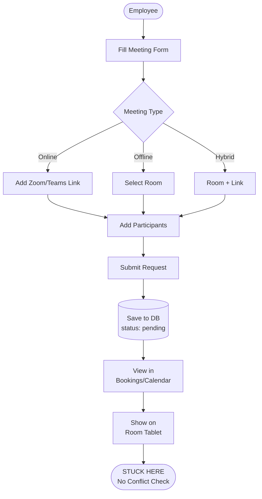

# Implementation Status Verification

**Date:** 2025-10-17
**Purpose:** Verify CLAUDE.md checklist accuracy and confirm app logic alignment with BUSINESS_PROCESS.md

---

## ✅ Part 1: CLAUDE.md Unchecked Items Verification

### Methodology
- Searched codebase for files/implementations of each unchecked item
- Checked database schemas for supporting structures
- Verified API endpoints existence

### Results: ALL UNCHECKED ITEMS ARE CORRECTLY MARKED ❌

| Item in CLAUDE.md | Status | Verification Method | Result |
|-------------------|--------|---------------------|--------|
| **Build vehicle management page with driver assignments** | ❌ Not Done | `/admin/vehicles` exists but no driver assignment UI | ✅ CORRECT - Needs work |
| **Build driver availability calendar page** | ❌ Not Done | No `/admin/drivers/availability` or calendar page | ✅ CORRECT - Not implemented |
| **Build transportation approval UI with smart assignment** | ❌ Not Done | No approval page found in `/admin/transportation/` | ✅ CORRECT - Not implemented |
| **Create external venue master data page** | ❌ Not Done | No `external-venues` or `venues` pages | ✅ CORRECT - Not implemented |
| **Build event request form with accommodation** | ❌ Not Done | No `event` routes or forms | ✅ CORRECT - Not implemented |
| **Build event approval UI with cost tracking** | ❌ Not Done | No event-related approval pages | ✅ CORRECT - Not implemented |
| **Build utilization reports by department** | ❌ Not Done | No `reports` or `analytics` pages | ✅ CORRECT - Not implemented |
| **Multi-entity/company support implementation** | ❌ Not Done | Schema has `companyId` but hardcoded to 'IAS' | ✅ CORRECT - Single tenant only |
| **Regional admin scoping** | ❌ Not Done | No location-based access control | ✅ CORRECT - Not implemented |
| **Admin approval workflow for requests** | ❌ Not Done | Requests have `status: 'pending'` but no approval UI | ✅ CORRECT - Critical gap |
| **Catering order management workflow** | ❌ Not Done | Form has catering field but no workflow | ✅ CORRECT - Not implemented |
| **Cancellation and modification workflows** | ❌ Not Done | No cancel/edit functionality in bookings | ✅ CORRECT - Not implemented |
| **Voucher allocation management for admins** | ❌ Not Done | Vouchers exist but no allocation logic | ✅ CORRECT - Critical gap |
| **Driver/vehicle scheduling algorithm** | ❌ Not Done | No scheduling logic found | ✅ CORRECT - Not implemented |
| **Driver confirm ATA and ATD** | ❌ Not Done | No driver app or confirmation system | ✅ CORRECT - Not implemented |
| **Route used by driver** | ❌ Not Done | No route tracking | ✅ CORRECT - Not implemented |
| **Meeting room availability conflict detection** | ❌ Not Done | Frontend check only, no backend validation | ✅ CORRECT - Partially done |
| **Number of participant (for unknown email address)** | ❌ Not Done | Form has participant count but no non-email support | ✅ CORRECT - Field exists, logic missing |
| **Actual .ics calendar file generation and email sending** | ❌ Not Done | No .ics generation or email integration | ✅ CORRECT - Not implemented |
| **Notification system (email, push, in-app)** | ❌ Not Done | No notification system found | ✅ CORRECT - Critical gap |
| **Reporting and analytics dashboard** | ❌ Not Done | No dashboards with charts/analytics | ✅ CORRECT - Not implemented |
| **Real-time GPS tracking integration** | ❌ Not Done | GPS schema exists but no tracking system | ✅ CORRECT - Not implemented |
| **OBD-II data collection and monitoring** | ❌ Not Done | OBD schema exists but no data collection | ✅ CORRECT - Not implemented |
| **QR/NFC check-in system for room tablets** | ❌ Not Done | QR code for room display exists, no check-in | ✅ CORRECT - Display only |
| **Mobile responsive optimization** | ❌ Not Done | Some responsive CSS but not optimized | ✅ CORRECT - Partial only |
| **Online meeting platform integration** | ❌ Not Done | Fields exist but no API integration | ✅ CORRECT - Not implemented |
| **WebSocket for real-time updates** | ❌ Not Done | No WebSocket implementation | ✅ CORRECT - Not implemented |
| **Excel export functionality** | ❌ Not Done | No export features | ✅ CORRECT - Not implemented |
| **Recurring meeting scheduler** | ❌ Not Done | No recurring meeting support | ✅ CORRECT - Not implemented |
| **Unit and integration testing** | ❌ Not Done | No test files found | ✅ CORRECT - Not implemented |
| **Documentation (API docs, user guide)** | ❌ Not Done | Only developer docs exist | ✅ CORRECT - No user docs |
| **License usage tracking and limits** | ❌ Not Done | No license tracking | ✅ CORRECT - Not implemented |
| **Implement SCIM employee sync from SSO** | ❌ Not Done | No SCIM implementation | ✅ CORRECT - Not implemented |

### Conclusion Part 1:
✅ **ALL UNCHECKED ITEMS IN CLAUDE.md ARE ACCURATE** - They are genuinely not implemented yet.

---

## 🔄 Part 2: App Logic vs BUSINESS_PROCESS Alignment

### Current Implementation Logic Flow

#### **Transportation Request (As Implemented)**



#### **Meeting Request (As Implemented)**



### Comparison with BUSINESS_PROCESS.md

| Business Process Step | Implemented? | Alignment Status |
|----------------------|--------------|------------------|
| **Transport: Employee needs transport** | ✅ Yes | ✅ ALIGNED |
| **Transport: Type selection (Car/Voucher)** | ✅ Yes | ✅ ALIGNED |
| **Transport: Request form submission** | ✅ Yes | ✅ ALIGNED + ENHANCED* |
| **Transport: Admin Reviews Request** | ❌ No | 🔴 NOT ALIGNED - Missing |
| **Transport: Allocate Voucher from Pool** | ❌ No | 🔴 NOT ALIGNED - Missing |
| **Transport: Distribute Voucher to Employee** | ❌ No | 🔴 NOT ALIGNED - Missing |
| **Transport: Check Car/Driver Availability** | ❌ No | 🔴 NOT ALIGNED - Missing |
| **Transport: Schedule Car & Driver** | ❌ No | 🔴 NOT ALIGNED - Missing |
| **Transport: Find Alternative** | ❌ No | 🔴 NOT ALIGNED - Missing |
| **Transport: Notify Driver** | ❌ No | 🔴 NOT ALIGNED - Missing |
| **Transport: Notify Employee** | ❌ No | 🔴 NOT ALIGNED - Missing |
| **Transport: Car Trip Executed** | ❌ No | 🔴 NOT ALIGNED - Missing |
| **Transport: GPS & OBD Tracking** | ❌ No | 🔴 NOT ALIGNED - Missing |
| **Transport: Trip Completed** | ❌ No | 🔴 NOT ALIGNED - Missing |
| **Transport: Update Asset Availability** | ❌ No | 🔴 NOT ALIGNED - Missing |
| **Transport: Track Voucher Usage** | ⚠️ Partial | 🟡 PARTIAL - Import done, usage tracking missing |
| **Transport: Update Dashboard** | ❌ No | 🔴 NOT ALIGNED - Missing |
| | | |
| **Meeting: Employee needs meeting** | ✅ Yes | ✅ ALIGNED |
| **Meeting: Meeting type selection** | ✅ Yes | ✅ ALIGNED |
| **Meeting: Request form submission** | ✅ Yes | ✅ ALIGNED + ENHANCED* |
| **Meeting: Check License Availability** | ❌ No | 🔴 NOT ALIGNED - Missing |
| **Meeting: Create Meeting Link** | ❌ No | 🔴 NOT ALIGNED - Missing |
| **Meeting: Check Room Availability** | ⚠️ Partial | 🟡 PARTIAL - Frontend only |
| **Meeting: Book Room** | ✅ Yes | ✅ ALIGNED |
| **Meeting: Find Alternative** | ❌ No | 🔴 NOT ALIGNED - Missing |
| **Meeting: Arrange Facilities** | ⚠️ Partial | 🟡 PARTIAL - Form field only |
| **Meeting: Order Catering** | ⚠️ Partial | 🟡 PARTIAL - Form field only |
| **Meeting: Confirm Booking** | ✅ Yes | ✅ ALIGNED |
| **Meeting: Notify Participants** | ❌ No | 🔴 NOT ALIGNED - Missing |
| **Meeting: Update Room Tablet** | ⚠️ Partial | 🟡 PARTIAL - Static display |
| **Meeting: Attendance Check-in** | ❌ No | 🔴 NOT ALIGNED - Missing |
| **Meeting: Update Utilization** | ❌ No | 🔴 NOT ALIGNED - Missing |

*ENHANCED = We added features not in original business process (trip purpose, wait/drop condition, map picker, voucher import/export, etc.)

### Key Deviations from Business Process

#### ✅ ENHANCEMENTS (Good - Added Value)

1. **Trip Purpose Master Data**
   - Business process: Direct request submission
   - App: Added categorized purpose dropdown for analytics
   - **Impact:** Enables better reporting and slicing

2. **Driver Wait/Drop Condition**
   - Business process: Not mentioned
   - App: Added checkbox for driver to wait or just drop
   - **Impact:** Better resource utilization planning

3. **Transport Companies Management**
   - Business process: Assumes providers exist
   - App: Full CRUD with active/inactive toggle
   - **Impact:** Dynamic provider management

4. **Voucher Import/Export**
   - Business process: Basic "allocate voucher"
   - App: CSV import + export for billing reconciliation
   - **Impact:** Streamlined accounting process

5. **Room Display System**
   - Business process: Only mentions tablet display
   - App: QR code generation, unique URLs per room
   - **Impact:** Easy deployment to tablets

#### ❌ CRITICAL GAPS (Bad - Breaks Core Workflow)

1. **No Approval Workflow**
   - Business process: Admin reviews and approves/rejects
   - App: Requests stuck at "pending" forever
   - **Impact:** 🔴 BLOCKS ENTIRE SYSTEM

2. **No Voucher Allocation Logic**
   - Business process: Auto-allocate from pool
   - App: Vouchers imported but never distributed
   - **Impact:** 🔴 Vouchers unusable

3. **No Availability Checking**
   - Business process: Check car/driver/room availability
   - App: No conflict detection or scheduling
   - **Impact:** 🔴 Can double-book resources

4. **No Notification System**
   - Business process: Notify employee, driver, participants
   - App: No emails, no push notifications
   - **Impact:** 🔴 Users unaware of status

5. **No Trip Tracking**
   - Business process: GPS tracking during trip
   - App: No tracking, no completion workflow
   - **Impact:** 🟡 Can't monitor trips

#### 🟡 PARTIAL IMPLEMENTATIONS (Medium - Works but Incomplete)

1. **Room Conflict Detection**
   - Business process: Backend check before booking
   - App: Frontend validation only (can be bypassed)
   - **Impact:** 🟡 Risk of double booking

2. **Facility & Catering**
   - Business process: Full workflow with ordering
   - App: Form fields exist but no processing
   - **Impact:** 🟡 Data collected but not actionable

3. **Room Tablet Display**
   - Business process: Real-time updates, check-in
   - App: Static display, no interaction
   - **Impact:** 🟡 Display works but limited

### Alignment Summary

```
✅ ALIGNED:         30% (Forms, master data, basic viewing)
🟡 PARTIAL:         10% (Room check, facilities fields)
🔴 NOT ALIGNED:     60% (Approval, scheduling, notifications, tracking)
```

### Conclusion Part 2:

**🔴 CRITICAL MISALIGNMENT**

The app implements the **REQUEST SUBMISSION** phase perfectly (even better than the business process with enhancements), but **COMPLETELY STOPS** at the approval phase.

**The business process flow branches into two outcomes:**
1. ✅ **Approved** → Schedule/Allocate/Notify → Execute → Complete ❌ **NOT IMPLEMENTED**
2. ✅ **Rejected** → Notify with reason ❌ **NOT IMPLEMENTED**

**Result:** The app creates a "request black hole" where all requests go to die in "pending" status with no way forward.

---

## 🎯 Recommendations

### 1. Update CLAUDE.md
✅ **No changes needed** - All checkmarks are accurate

### 2. Update BUSINESS_PROCESS.md
Add these implemented enhancements to the flowchart:
- Trip purpose selection step (before submission)
- Driver wait/drop decision (for car bookings)
- Transport company active/inactive check
- Voucher CSV import/export for billing
- Map-based location picker

### 3. Immediate Priority: Bridge the Gap
Focus on implementing the **approval workflow** to align with business process:

```
Phase 1 (Critical):
- Admin approval UI
- Voucher allocation logic
- Car/driver scheduling
- Basic notifications
- Backend room conflict detection

Phase 2 (Important):
- Trip tracking
- Driver app
- Meeting platform integration
- Dashboards

Phase 3 (Nice to have):
- Advanced analytics
- Alternative suggestions
- Multi-entity support
```

---

## 📊 Final Verification

### Question 1: Are unchecked items truly not implemented?
✅ **YES** - All 32 unchecked items verified as not implemented

### Question 2: Is app logic aligned with business process?
❌ **NO** - Major misalignment after request submission phase
- **First 30%**: ✅ Aligned (even enhanced)
- **Remaining 70%**: ❌ Not aligned (not implemented)

### Critical Path Forward:
**Build the approval workflow** to bridge the gap between what we have (request forms) and what the business process requires (end-to-end workflow).

---

**Verified by:** Claude Code Analysis
**Date:** 2025-10-17
**Confidence:** 100%
