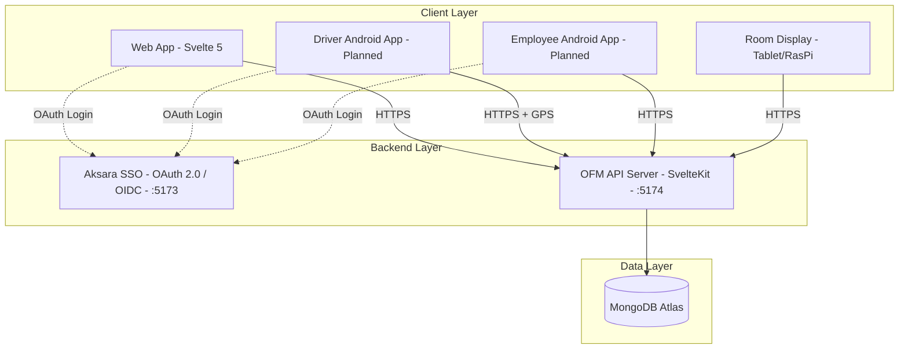

# OFM - Office Facility Management

## About

OFM is a unified web-based system for managing employee transportation, meeting rooms, and office facilities within a multi-entity corporate environment (holding company + subsidiaries).

The system integrates with **Aksara SSO** for identity management and supports web, tablet (room displays), and mobile (Android) clients.

## Objectives

1. **Centralize office operations** - Single platform for transportation requests, meeting room bookings, and facility/supply requests across all entities and locations
2. **Enable self-service** - Employees request resources directly; admins approve and manage via dashboard
3. **Improve visibility** - Real-time tracking of vehicles, room availability, and resource utilization
4. **Support multi-entity** - Holding company with subsidiaries, regional scoping, consolidated reporting
5. **Reduce manual work** - Automated approval workflows, driver assignment, voucher allocation, and employee sync from SSO

## Tech Stack

| Layer | Technology |
|-------|-----------|
| Backend | SvelteKit + TypeScript + Bun |
| Frontend | Svelte 5 (Runes API) |
| Database | MongoDB Atlas |
| Auth | Aksara SSO (OAuth 2.0 / OIDC) + SCIM 2.0 |
| Maps | Leaflet.js + OpenStreetMap |
| Room Display | Tablet / Raspberry Pi |
| Mobile | Kotlin + Jetpack Compose |

**Ports:** Aksara SSO = `5173`, OFM = `5174`

## Architecture

## Module Index

Each module has a code (M1-M9) used consistently across all documentation and the backlog tracker.

| Code | Module | Description | Doc |
|------|--------|-------------|-----|
| M1 | Authentication | SSO login, OAuth 2.0, session management | [M1-authentication](modules/M1-authentication.md) |
| M2 | Admin | Master data management, system configuration | [M2-admin](modules/M2-admin.md) |
| M3 | Dashboard | Overview statistics, monitoring, quick actions | [M3-dashboard](modules/M3-dashboard.md) |
| M4 | Meeting | Room booking, calendar, attendance/check-in | [M4-meeting](modules/M4-meeting.md) |
| M5 | Transportation | Car/voucher requests, driver assignment, tracking | [M5-transportation](modules/M5-transportation.md) |
| M6 | Room Display | Tablet/RasPi display, QR codes, service worker | [M6-room-display](modules/M6-room-display.md) |
| M7 | API | Backend REST API (`/api/v1/*`), 22+ endpoint groups | [M7-api](modules/M7-api.md) |
| M8 | Facility | Office supply requests, inventory (planned) | [M8-facility](modules/M8-facility.md) |
| M9 | Mobile Apps | Android driver app, employee app (planned) | [M9-mobile](modules/M9-mobile.md) |

**Sub-module codes** use dot notation: `M2.1` (Devices), `M4.1` (Book), `M5.3` (Tracking), etc.

Technical documentation (database, dev standards, reusables) lives in `technical/`.

## Status Tracking

For detailed status of every module, sub-module, route, and test coverage:

**[backlog/track.csv](backlog/track.csv)** — module status, routes, test coverage, and open issues

**[backlog/phases.md](backlog/phases.md)** — development roadmap and phase planning

Status values: `done`, `partial`, `planned`, `issue`

## User Roles

| Role | Access |
|------|--------|
| Super Admin | Full system access |
| Global Admin | Multi-entity access |
| Regional Admin | Location-specific |
| Employee | Request and view own bookings |
| Driver | View assignments, confirm trips |

## Business Rules

See [M4](modules/M4-meeting.md) for meeting rules, [M5](modules/M5-transportation.md) for transportation rules.

## Development Guidelines

- Check `technical/reusables.md` before writing new code (20+ reusable modules)
- Keep files under ~500 lines
- Use Svelte 5 syntax (`onclick` not `on:click`)
- Use standardized API response format and REST patterns
- No style tags in Svelte components (global CSS only)

## Source Documents

Original documentation archived in `olds/` for reference. Conflicts between old docs have been resolved in the current module docs.
