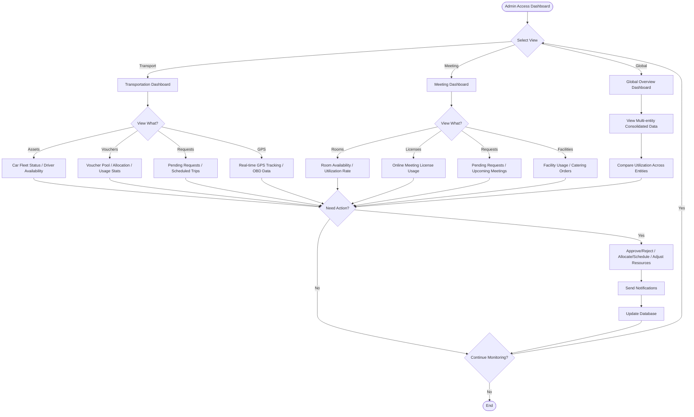

# M3 - Dashboard

Main landing page providing administrators and employees with an at-a-glance overview of transportation and meeting room operations.

**Route:** `/dashboard`

---

## Features

### Overview Statistics

- Transportation stats: total vehicles, available, in-use, maintenance
- Driver availability status
- Meeting room stats: total rooms, available, occupied, maintenance
- Today's meeting count
- Voucher pool summary by provider (Gojek, Grab)
- License usage by platform (Zoom, Google Meet, MS Teams)

### Quick Actions

- Request transportation (links to M5)
- Book meeting room (links to M4)
- View pending approvals (links to M2 admin workflows)

### Recent Activities

- Recent bookings feed (transportation and meeting)
- Upcoming bookings list

---

## Admin Monitoring Process

The dashboard serves as the central hub for admin monitoring.

### Flow Summary

1. **Select view** -- Admin chooses between Transportation, Meeting, or Global dashboards
2. **Drill down** -- Inspect specific data (assets, vouchers, requests, GPS, rooms, licenses, facilities)
3. **Take action** -- Approve/reject requests, allocate resources, adjust schedules
4. **Notify** -- Actions trigger notifications to affected users
5. **Loop** -- Admin returns to monitoring or exits

---

## Related Modules

| Module | Relationship |
|--------|-------------|
| M2 (Admin) | Dashboard links to admin master data and approval workflows |
| M4 (Meeting) | Meeting room stats and quick-action links |
| M5 (Transportation) | Transportation stats and quick-action links |
| M6 (Room Display) | Room status data feeds into dashboard overview |
