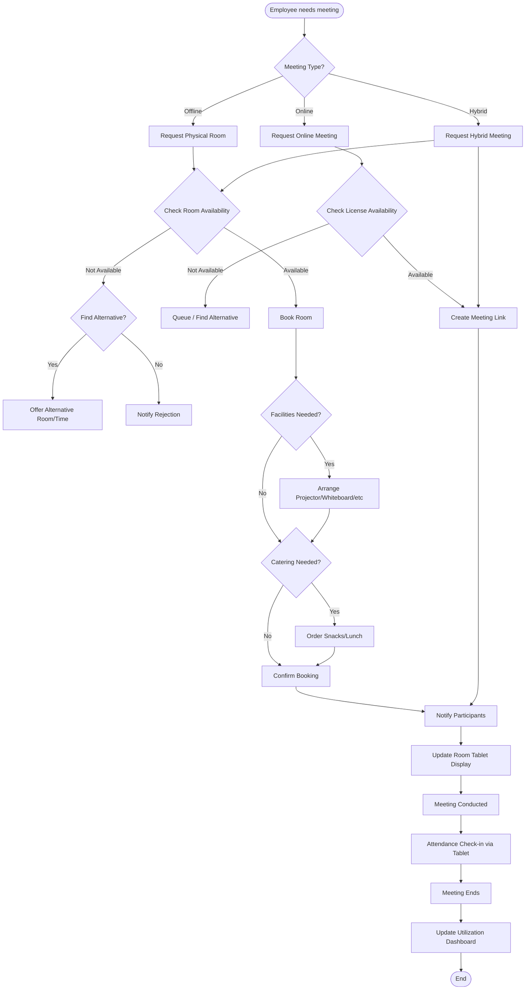

# M4 - Meeting

Meeting room booking system supporting online, offline, and hybrid meetings. Includes room reservation, calendar views, participant management, catering, and calendar invitation generation.

---

## Sub-Modules

### M4.1 Book

Meeting room booking form with comprehensive options.

**Route:** `/meeting/book`

#### Meeting Types

| Type | Description |
|------|-------------|
| Online | Video conference only (Zoom, Google Meet, MS Teams) |
| Offline | Physical room reservation |
| Hybrid | Both online platform + physical room |

#### Form Fields

- **Title** -- Meeting title
- **Date & Time** -- Start time, end time, duration calculator
- **Meeting type** -- Online / Offline / Hybrid
- **Room selection** -- Visual room cards filtered by meeting type (offline/hybrid only)
- **Platform** -- Zoom, Google Meet, MS Teams (online/hybrid only)
- **Internal participants** -- Tag-based email input
- **External participants** -- Email addresses for non-employees
- **External participant count** -- For guests without email
- **Required facilities** -- Checklist: projector, whiteboard, etc.
- **Catering** -- Type (snacks, lunch), item count, notes
- **Recurring** -- Recurring meeting settings (requires Super Admin approval)

#### Validation

- Room capacity validated against participant count
- Max duration: 8 hours
- Room availability conflict detection (planned)

---

### M4.2 Bookings

View and manage meeting bookings.

**Route:** `/meeting/bookings`

- List of all bookings with status filters
- Booking details: title, room, time, participants, status
- Cancel / modify actions
- Status: pending, approved, rejected, cancelled, completed

---

### M4.3 Calendar

Calendar view for meeting room schedules.

**Route:** `/meeting/calendar`

- Room-based calendar view
- Day / week / month views
- Visual room availability
- Links to booking form for available slots

---

## Booking Process



---

## Attendance / Check-In

Supports both internal employees and external guests via QR code or manual entry.

- **Check-in window:** 15 minutes before meeting start to meeting end
- **No invitation required** -- Anyone can check in during the meeting window
- **Methods:** QR scan (from room tablet) or manual entry (NIK for internal, name for external)

### Attendee Data Structure

```javascript
attendees: [{
  type: 'internal' | 'external',
  userId: String | null,    // NIK for internal, null for external
  name: String,
  email: String,
  checkinTime: Date,
  method: 'qr' | 'manual'
}]
```

---

## Calendar Invitation (.ics)

- Generates `.ics` calendar files for meeting notifications
- Includes meeting title, time, room, participants
- Actual email sending: planned

---

## Business Rules

- **Max duration:** 8 hours per booking
- **Recurring meetings:** Require Super Admin approval
- **Cancellation:** Requires re-approval from admin
- **Room capacity:** Validated against participant count
- **Approval:** Configurable per room (VIP rooms need approval, regular rooms auto-approved -- pending implementation)

---

## Route Summary

| Route | Sub-Module |
|-------|------------|
| `/meeting` | Meeting overview (stats, upcoming, quick actions) |
| `/meeting/book` | M4.1 Book |
| `/meeting/bookings` | M4.2 Bookings |
| `/meeting/calendar` | M4.3 Calendar |

---

**API Endpoints:** See [M7-api](M7-api.md) sections M7.15, M7.16

**Related:** [M2.3 Rooms](M2-admin.md), [M6 Room Display](M6-room-display.md), [M7 API](M7-api.md)
