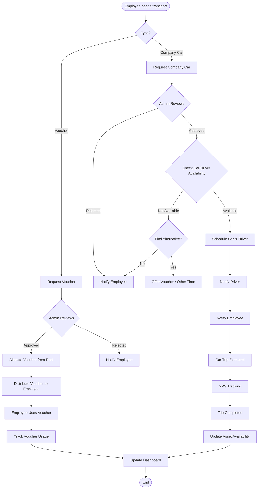

# M5 - Transportation

Employee transportation management supporting company car bookings with driver assignment and transportation voucher allocation (Gojek, Grab). Includes GPS tracking, round-trip support, and OpenStreetMap integration.

---

## Sub-Modules

### M5.1 Booking

Transportation booking overview with fleet and voucher statistics.

**Route:** `/transportation/booking`

- Vehicle fleet stats: total, available, in-use, maintenance
- Driver availability status
- Voucher pool summary by provider (Gojek, Grab)
- Recent bookings table
- Quick action buttons

---

### M5.2 Request

Transportation request form with two modes.

**Route:** `/transportation/request`

#### Request Types

| Type | Description |
|------|-------------|
| Company Car | Car with driver, map-based pickup/destination |
| Voucher | Gojek/Grab voucher allocation |

#### Form Fields (Company Car)

- **Date & time** -- Scheduled pickup time
- **Pickup location** -- Address with map picker (Leaflet + OpenStreetMap)
- **Destination** -- Address with map picker
- **Round trip** -- Toggle for return trip with return time
- **Passenger count** -- Number of passengers
- **Passengers** -- Email addresses of additional passengers
- **Trip purpose** -- Dropdown from master data (for analytics)
- **Driver condition** -- Wait / Drop (driver waits at destination or returns)
- **Priority** -- Low, medium, high
- **Special requirements** -- Free text (wheelchair access, etc.)
- **Vehicle selection** -- Visual vehicle cards with capacity info

#### Form Fields (Voucher)

- **Date & time** -- When voucher is needed
- **Pickup / Destination** -- Addresses
- **Round trip** -- Toggle
- **Voucher provider** -- Gojek, Grab (from active transport companies)
- **Trip purpose** -- Dropdown from master data

---

### M5.3 Tracking

Real-time GPS tracking of company cars during trips. Planned -- requires Android Driver App.

**Route:** `/transportation/tracking` (planned)

- Real-time map with vehicle positions
- Trip route visualization
- ETA calculation
- Historical route playback

---

## Request Process

---

## Trip Lifecycle

| Status | Description |
|--------|-------------|
| `pending` | Request submitted, awaiting admin review |
| `approved` | Admin approved, vehicle/driver assigned |
| `rejected` | Admin rejected with reason |
| `in_progress` | Trip started (driver confirmed ATA) |
| `completed` | Trip finished (driver confirmed ATD or 12h auto-complete) |
| `cancelled` | Cancelled by employee or admin |

---

## Driver Assignment

- Admin manually assigns available driver + vehicle upon approval
- Smart assignment algorithm: planned
- Driver notification: immediate + 2h reminder (planned)
- Driver confirms ATA (Actual Time of Arrival at pickup)
- Driver confirms ATD (Actual Time of Departure / delivery)

---

## GPS Tracking (via Android Driver App)

- Background GPS service during active trips
- Location updates every 30 seconds
- Route recording and submission
- Offline mode with sync when online
- Replaces Arduino + GPS module (lower cost, better UX)

---

## Business Rules

- **Cancellation:** Re-enables car as available
- **After-hours:** Requires advance booking
- **Alternative offer:** When car unavailable, admin decides whether to offer voucher (system suggests)
- **Trip completion:** Driver confirms + 12h auto-complete fallback
- **Round trip:** Supported for both car and voucher requests

---

## Route Summary

| Route | Sub-Module |
|-------|------------|
| `/transportation` | Transportation overview (stats, recent bookings) |
| `/transportation/booking` | M5.1 Booking overview |
| `/transportation/request` | M5.2 Request form |
| `/transportation/tracking` | M5.3 GPS tracking (planned) |

---

**API Endpoints:** See [M7-api](M7-api.md) sections M7.17, M7.18, M7.19, Driver API

**Related:** [M2 Admin](M2-admin.md) (Drivers, Vehicles, Vouchers), [M9.1 Driver App](M9-mobile.md)
