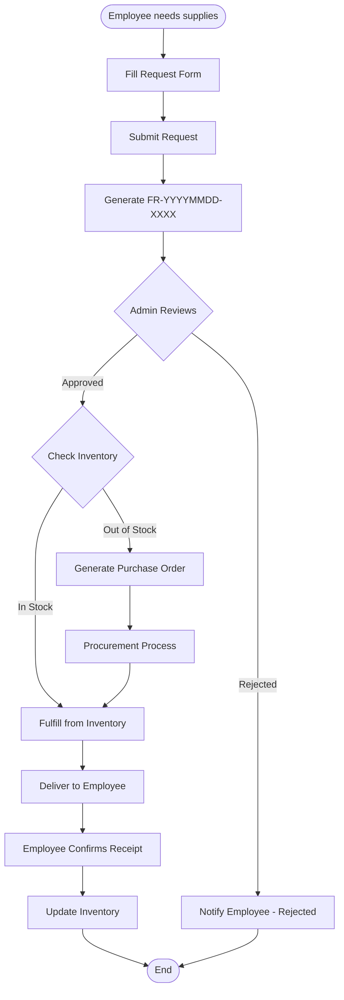

# M8 - Facility

Office facility and supply request module. Employees can request office supplies (ATK), equipment, and other facilities through a self-service workflow with admin approval.

**Status:** Planned

---

## Features (Planned)

### Employee Requests

- Request office supplies (ATK: pens, paper, toner, etc.)
- Request equipment (laptop, monitor, projector, etc.)
- Request furniture
- Track request status
- View request history

### Admin Management

- Pending requests dashboard
- Approve / reject with notes
- Inventory tracking (stock levels)
- Purchase order generation
- Cost tracking by department

---

## Request Types

| Type | Code | Description |
|------|------|-------------|
| Office Supplies | `atk` | Pens, paper, toner, staples, etc. |
| Equipment | `equipment` | Laptop, monitor, projector, phone |
| Furniture | `furniture` | Desk, chair, cabinet |
| Other | `other` | Miscellaneous facility requests |

---

## Request Process

---

## Request Form Fields

- **Request type** -- ATK, equipment, furniture, other
- **Category** -- Sub-category within type
- **Items** -- List of items with:
  - Item name
  - Item code (from catalog)
  - Quantity
  - Unit (pcs, ream, box, etc.)
  - Description / notes
  - Estimated price
- **Delivery location** -- Building, floor, room
- **Delivery date** -- Requested delivery date
- **Urgency** -- Low, medium, high, urgent
- **Purpose** -- Why the items are needed
- **Notes** -- Additional instructions

---

---

**API Endpoints:** See [M7-api](M7-api.md) section M7.13

**Related:** [M3 Dashboard](M3-dashboard.md), [M9.2 Employee App](M9-mobile.md)
