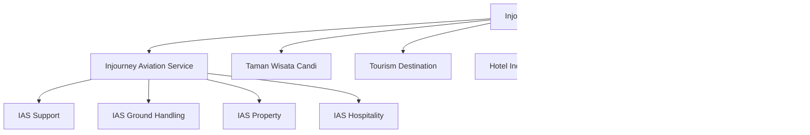

# Sample Organization Structure

IAS (Indonesian Aviation Services) organization charts used as reference data for OFM multi-entity support.

---

## IAS Parent, Siblings, and Subsidiaries

---

## IAS Internal Structure

### Legend

- **Teal nodes:** Directors (Board of Directors)
- **Yellow/Blue nodes:** Band 1 -- heads of units one level under Director
- **Subprocess nodes (double border):** Band 2 -- heads of units one level under Band 1
- **Green stadium nodes:** SDU (Strategic Delivery Unit) -- no Band 2
- **Transparent subgraphs:** Grouping only, not actual unit kerja

---

## Branch Offices by Region

---

## Relevance to OFM

- **Multi-entity:** IAS holding + 4 subsidiaries
- **Regional scoping:** 4 regions, 30+ branch offices (IATA codes as location IDs)
- **Approval hierarchy:** Directors > Band 1 > Band 2
